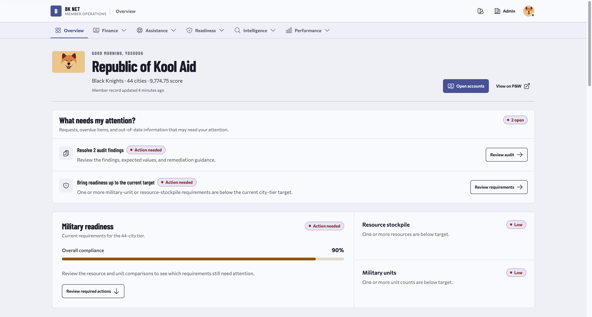
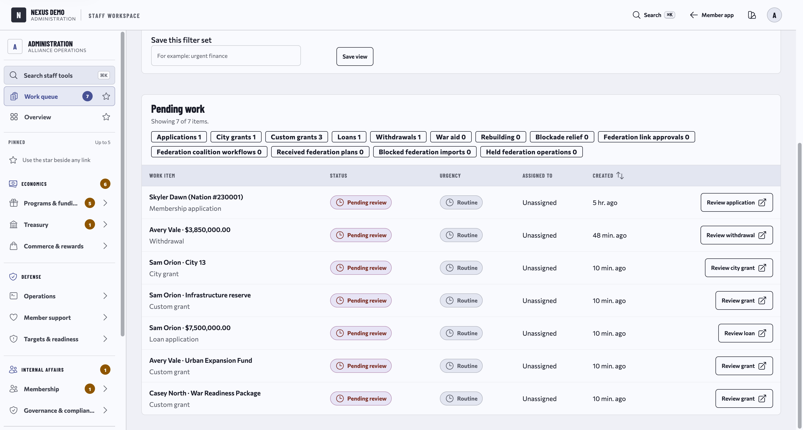
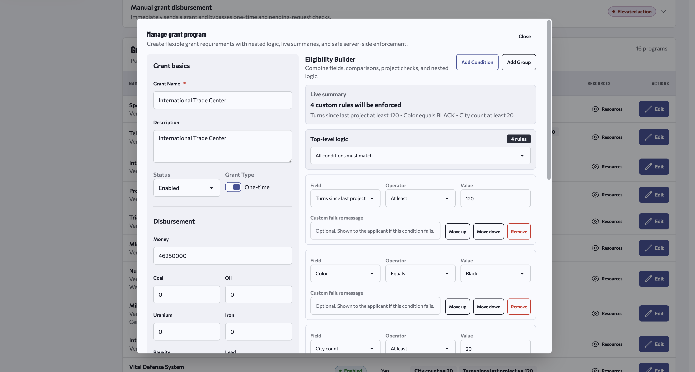
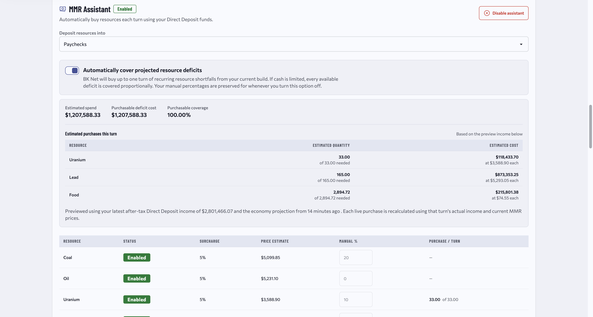
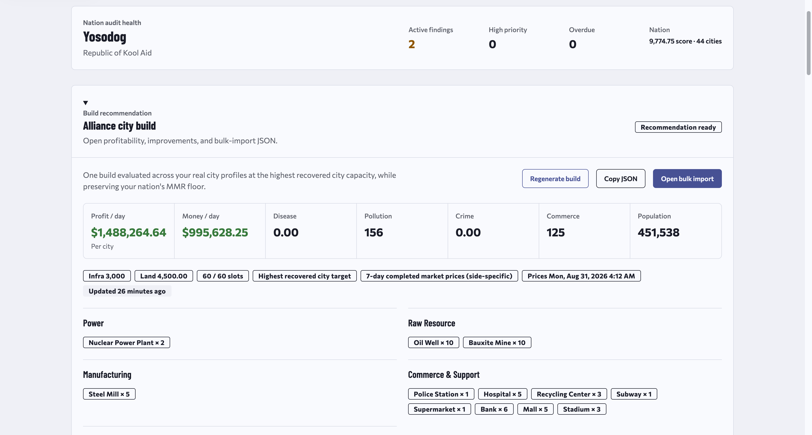
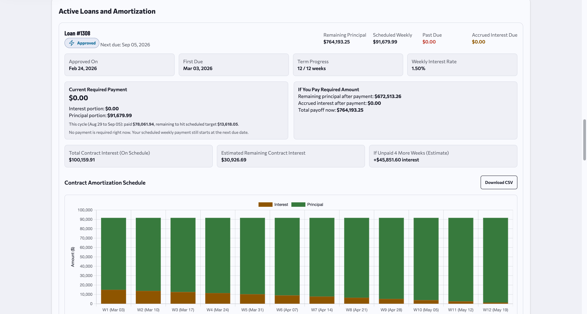
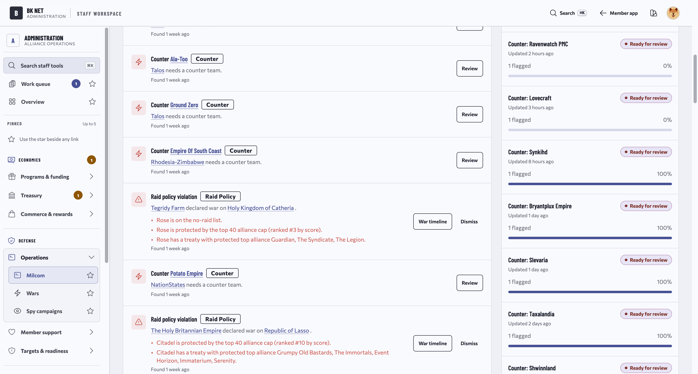
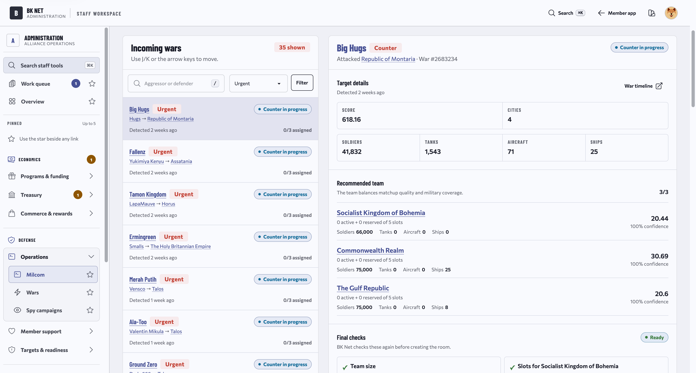
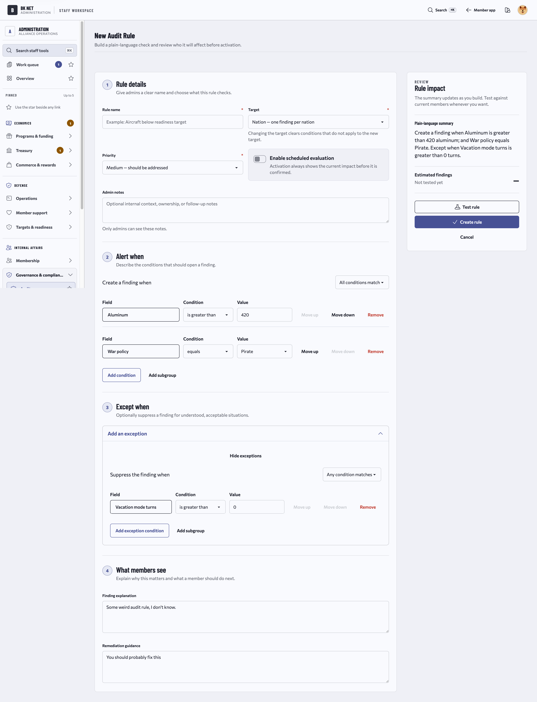

# Nexus AMS

Nexus AMS is an open-source alliance management system for [Politics & War](https://politicsandwar.com/). It brings banking, grants, loans, recruitment, audits, military operations, and member services into one application, with Discord commands and notifications connected to the same records and permissions.

## Beta status

Nexus AMS is in beta. Bugs and configuration changes are still possible before 1.0.

Use a tagged beta release for an installation. The `main` branch is for ongoing development and may move ahead of the latest supported release.

## Why Nexus

Alliance tools often begin as a collection of Discord commands. That works for simple actions, but it becomes difficult to track applications, approvals, balances, policy decisions, military assignments, and staff access across channels.

Nexus keeps that work in a proper application. Members have one place for accounts, requests, readiness, and alliance programs. Staff have searchable queues, reports, policy controls, and an audit trail. Discord remains available for quick commands, private notifications, interviews, intelligence capture, and war rooms, but Nexus is the source of truth.

The systems share the same member records, permissions, settings, and history. A grant requested through Discord follows the same requirements as one requested on the web. A staff decision remains visible after the Discord conversation is gone. Many alliance policies can be changed from the admin interface without adding a new command or editing application code.

## Screenshots

### Member overview

The member dashboard puts open tasks, audit findings, military readiness, and stockpile warnings in one place.



### Staff work queue

Staff get one permission-aware queue for applications, grants, loans, withdrawals, and other work that needs review.



### Custom grant programs

Grant programs combine a configurable payout with nested eligibility rules. Staff can use nation data, policies, projects, military levels, membership history, and other fields without writing code.



### MMR Assistant

MMR Assistant can reserve part of a member's Direct Deposit income for resources. Automatic mode estimates recurring shortages and shows the expected cost and coverage before each purchase.



### Member audits and build guidance

Members can review active findings, remediation guidance, and city build recommendations based on current alliance policy.



### Loans and amortization

Loan pages show principal, scheduled payments, interest, term progress, payoff information, and the full amortization schedule.



### War operations

The operations workspace combines incoming wars, counter requests, raid-policy violations, delivery status, and staff actions.



### Counter coordination

Counter coordinators can inspect an incoming war, compare recommended defenders, and confirm that the team is ready before creating a war room.



### Audit rule creation

Staff can build audit rules with grouped conditions, exceptions, priorities, scheduled evaluation, member-facing explanations, and remediation guidance. A plain-language summary shows what the rule will do before it is activated.



## Features

### Banking and alliance finance

- Member and alliance accounts with deposits, withdrawals, transfers, limits, freezes, and downloadable statements
- Staff review queues, liquidity tools, reconciliation, finance reports, and a durable history of decisions
- Tax brackets, collection jobs, import checkpoints, alliance summaries, and offshore support
- Payroll, an alliance market, Growth Circles, and a configurable weekly lottery
- Direct Deposit, which applies a city-based tax bracket and credits the remaining revenue to the member's chosen account
- MMR Assistant, which can use Direct Deposit funds to cover projected resource shortages or follow a member's manual allocation

### Grants, loans, and member support

- City grants, custom grant programs, loans, war aid, rebuilding assistance, and manual disbursements
- One-time or repeatable programs with configurable money and resource payouts
- Nested eligibility rules based on nation, city, economy, military, policy, project, membership, and stockpile data
- Clear failure messages so members can see which requirements they have not met
- Server-side checks shared by the web application and Discord bot
- Approval controls, request history, amortization schedules, and protection against duplicate pending requests

Grant requirements are not tied to a fixed command. Staff can require a minimum city count, a specific project, a military threshold, time since the last project, a resource level, or a nested combination of conditions. Rules can require all conditions, any condition, or none of them. Staff can revise the policy from the admin interface, and Nexus applies it everywhere the program is available.

### Recruitment and membership

- Scheduled recruitment messages for eligible nations, with contact history to prevent duplicate outreach
- An optional follow-up message after 60 hours, skipped when the nation has already joined an alliance
- Public recruitment pages, application forms, and account verification
- Discord interview channels with recoverable Nexus metadata and transcript forwarding
- Staff review, onboarding, member history, inactivity workflows, and alliance membership checks

### Military operations and intelligence

- Incoming-war monitoring, counter recommendations, assignments, war plans, and readiness checks
- Raid finding, raid-policy violations, war statistics, attack simulators, beige alerts, and reimbursement workflows
- Spy operations, intelligence reports, and member or API report submission
- Automatic capture of pasted in-game intelligence reports through the Discord bot
- Discord war-room creation and archival with the plan and delivery state retained in Nexus
- Staff workspaces for reviewing targets, recommended defenders, available slots, and team coverage

### Audits and readiness

- Configurable audit rules with priorities, grouped conditions, exceptions, and scheduled evaluation
- Member-safe findings with explanations, remediation guidance, and decision history
- Military readiness and resource targets by city tier
- City build recommendations evaluated against a member's current cities and alliance policy
- Permission-scoped staff views and audit logging for sensitive actions

### Federation

Federation is an advanced beta feature for sharing selected military planning data between Nexus installations. It is disabled by default.

Each link is bilateral and uses signing and encryption keys. Administrators control sharing by direction, peer, coalition, and resource type. The first federation protocol supports war-plan snapshots, including recipient review, expiry, payload hashes, signed delivery, and local draft import. Each installation keeps its own authoritative records and can suspend or revoke links and keys.

See [Federation operations](docs/federation-operations.md) and the [federation protocol](docs/federation-protocol-v1.md) for the full model.

### Member tools and customization

- Profitability and raid leaderboards with date filters and member rankings
- City, infrastructure, land, project, research, military purchase, and city-economics calculators
- Custom pages and Nexus Expression Language support for alliance-specific content
- Configurable public content, roles, permissions, notifications, tax behavior, offshores, military settings, and operational rules
- Personal API tokens and protected endpoints for additional automation

## Companion services

Nexus uses separate repositories for the web application, Discord process, subscription listener, and installer. Pin each component to a compatible beta tag or exact commit because the repositories have separate release histories.

### Nexus AMS Discord

[Nexus AMS Discord](https://github.com/Yosodog/Nexus-AMS-Discord) connects Discord to Nexus permissions and workflows. It supports commands for accounts, transactions, requests, grants, loans, builds, war aid, raids, wars, spy assignments, and applications.

The bot also handles account linking, private notifications, interview channels, intelligence-report capture, member departures, alliance role removal, and war-room creation and archival. Protected actions are authorized by Nexus rather than trusted solely because they came from Discord. Queue leases, retries, acknowledgements, signed interaction proofs, and stable delivery identifiers reduce duplicate or lost work.

Dedicated self-hosting supports one Nexus installation. A shared hosted mode exists for managed development and Cloud pilots, but public hosted-bot onboarding is not ready yet.

### Nexus AMS Subs

[Nexus AMS Subs](https://github.com/Yosodog/Nexus-AMS-Subs) listens for Politics & War GraphQL subscription events through Pusher. It sends nation, alliance, and war changes to Nexus without waiting for the next scheduled full synchronization.

Subs supports protected HTTP delivery or signed Redis Streams delivery. It includes bounded concurrency, retries, dead-letter storage, health checks, and graceful shutdown. The delivery mode is explicit so it does not switch transports after an ambiguous failure.

### Nexus Setup

[Nexus Setup](https://github.com/Yosodog/Nexus-Setup) installs a standalone deployment on Ubuntu. It can place the application, web server, database, and subscription listener on one host or use split profiles for remote databases and separate web or Subs hosts.

The installer configures the required system packages, Nginx, MySQL or MariaDB, optional Redis, Supervisor, Laravel scheduling, TLS, migrations, seed data, frontend assets, and an optional first administrator. Production installs use exact AMS and Subs commit SHAs so rerunning the installer does not silently move to newer code.

## Stack

- PHP 8.3 and Laravel 13
- MySQL or compatible MariaDB
- Blade and Livewire 3
- Tailwind CSS 4, DaisyUI 5, and MaryUI 2
- Vite 6
- Sanctum, Fortify, Pulse, and Telescope

## Local development

Requirements:

- PHP 8.3 or later
- Composer
- Node.js 20 or later
- MySQL 8 or compatible MariaDB
- Redis is optional locally and recommended for production queue, cache, and session workloads

```bash
git clone https://github.com/Yosodog/Nexus-AMS.git
cd Nexus-AMS
composer install
npm install
cp .env.example .env
php artisan key:generate
php artisan migrate --seed
npm run build
composer run dev
```

Set the application URL, database credentials, Politics & War API credentials, alliance ID, and Nexus API token in `.env` before first sign-in. Add the Discord bot key when using Discord-connected workflows. Do not commit `.env`.

`composer run dev` starts the Laravel server, queue listener, log tailer, and Vite development server.

Useful checks before submitting a change:

```bash
./vendor/bin/pint --dirty
composer test:fast
npm run build
```

See [AGENTS.md](AGENTS.md) for repository conventions, testing guidance, and security requirements. UI changes should follow [DESIGN_SYSTEM.md](DESIGN_SYSTEM.md).

## Production and self-hosting

Use [Nexus Setup](https://github.com/Yosodog/Nexus-Setup) for a standalone production installation. Pin `NEXUS_AMS_COMMIT` and `NEXUS_SUBS_COMMIT` to the beta revisions you intend to deploy. The installer supports single-host and split-host profiles.

```bash
git clone https://github.com/Yosodog/Nexus-Setup.git
cd Nexus-Setup
chmod 600 install.env
nano install.env
./install_nexus.sh --check-config
sudo ./install_nexus.sh --non-interactive
```

The repository also contains a hardened container build for managed deployments. Its runtime roles, release metadata, health contracts, and deployment restrictions are intended for an orchestrated environment rather than a basic standalone install.

## Nexus Cloud

Nexus Cloud is the managed deployment path under development. The application already contains the runtime boundaries and service contracts needed by managed environments, but public Cloud onboarding is not ready yet.

Self-hosted installations should use `NEXUS_RUNTIME=standalone` through Nexus Setup. The hosted runtime modes are for operator-managed development and pilots.

## Contributing

Keep changes focused and follow the conventions in [AGENTS.md](AGENTS.md). Use descriptive, present-tense commit messages. Pull requests should describe user-visible effects and call out migrations, cache clears, scheduler changes, or queue-worker restarts.

Before opening a pull request, run the relevant tests and `./vendor/bin/pint --dirty` after changing PHP. Do not commit secrets, `.env` files, or built frontend assets.

## Reporting bugs and requests

Open an issue in [Nexus AMS Issues](https://github.com/Yosodog/Nexus-AMS/issues). Include the expected behavior, actual behavior, and reproduction steps. For operational issues, note whether the problem affects the web application, queue worker, scheduler, subscription service, or Discord integration.

## License

Nexus AMS is licensed under the GNU GPL v3. See [LICENSE](LICENSE).
