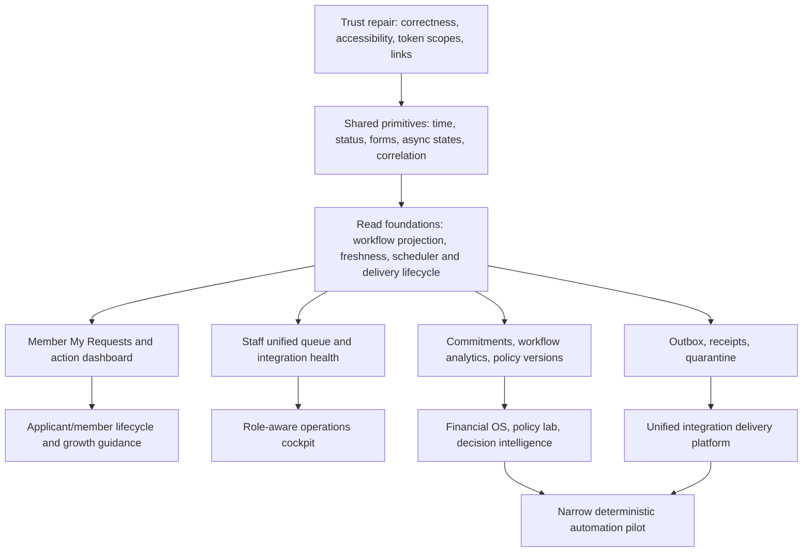

# Nexus AMS Improvement Roadmap

> A prioritized, implementation-oriented backlog of product, UX, accessibility, security, reliability, architecture, and strategic opportunities.

**Assessment date:** August 3, 2026
**Status:** Proposal—not an approved implementation plan
**Scope:** The current Nexus AMS repository and its member, staff, public, Discord, Politics & War, finance, audit, recruitment, notification, and military workflows

## Executive recommendation

Nexus does **not** need a ground-up rewrite. Its Laravel modular-monolith foundation is appropriate for the product, the application already has substantial domain coverage, and the public/member visual foundation is stronger than a typical internal alliance tool. A rewrite would consume a large amount of effort while reintroducing solved authorization, finance, workflow, and integration problems.

The largest opportunity is cohesion. Nexus has many useful capabilities, but members and staff still need a clearer answer to three questions:

1. What needs my attention now?
2. What is the status of the requests and work I care about?
3. Is the underlying data and integration machinery healthy enough to trust?

The recommended direction is therefore:

- Repair correctness and trust defects first.
- Create a member-facing **My Requests** center and action-first dashboard.
- Create a staff-facing **Unified Work Queue** and eventually a role-aware operations cockpit.
- Make data freshness, external delivery, scheduler health, and recovery visible.
- Turn recruitment into one coherent applicant-to-member journey.
- Split oversized settings and backend modules incrementally, preserving current contracts.
- Finish or deliberately sunset legacy Milcom behavior after the in-progress Milcom v2 work is proven.
- Reserve automation and decision intelligence for later, after workflows have shared projections, reliable audit data, and measurable safeguards.

## Highest-priority shortlist

This is the recommended ranking when roadmap capacity is limited. “Trust correctness repair” means the complete P0 set, not one isolated ticket.

| Rank | Improvement                          | Primary IDs                     | Size          | Reason for rank                                                                                          |
| ---: | ------------------------------------ | ------------------------------- | ------------- | -------------------------------------------------------------------------------------------------------- |
|    1 | Trust and correctness repair         | P0-01–P0-10                     | S–M each      | Incorrect numbers, broken links, accessibility gaps, and overbroad tokens undermine every other feature. |
|    2 | Member **My Requests**               | P1-01–P1-03                     | M             | Resolves the most common status/ownership ambiguity for members.                                         |
|    3 | Unified staff work queue             | P1-41, P1-05                    | M–L           | Gives staff one reliable view of pending work and aging.                                                 |
|    4 | Action-first member dashboard        | P1-34                           | M             | Turns existing capabilities into a clear daily member workflow.                                          |
|    5 | Coherent recruitment and activation  | P0-05, P1-24–P1-26, P1-43       | M overall     | Fixes the public-to-member journey before adding a larger CRM.                                           |
|    6 | Split user/admin settings navigation | P1-35                           | M             | Reduces one of the application's highest cognitive-load areas.                                           |
|    7 | Page-scoped frontend bundles         | P1-27–P1-29                     | M             | Improves performance and enables stronger CSP without a frontend rewrite.                                |
|    8 | Strict production CSP                | P1E-01                          | M             | Meaningfully limits injection impact after inline-script cleanup.                                        |
|    9 | Scoped API tokens                    | P0-10                           | M             | Reduces the blast radius of a leaked personal token.                                                     |
|   10 | Integration and job health center    | P1-42, P1E-06                   | M             | Makes stale data, scheduler failures, and delivery failures diagnosable.                                 |
|   11 | Atomic deployment/update process     | P1E-05                          | M–L           | Reduces the risk of a failed self-update leaving a mixed release.                                        |
|   12 | Settings backend decomposition       | P1E-02, P1E-03                  | M–L           | Shrinks a major hotspot while preserving current configuration contracts.                                |
|   13 | Global staff command palette         | P1-36                           | M             | Provides high leverage across an already broad admin surface.                                            |
|   14 | Accessibility hardening program      | P0-07–P0-09, P1-20, P1-30–P1-31 | S–M per slice | Removes concrete barriers and prevents regressions.                                                      |
|   15 | Finish or sunset legacy Milcom       | P2E-07                          | L             | Prevents two military systems from remaining active indefinitely.                                        |

## How to use this document

This is a backlog and sequencing guide, not a requirement to build every idea. Every suggestion includes enough information to decide whether it belongs on the roadmap, shape an implementation, and validate the result.

Priorities are based on user harm, correctness, security, operational leverage, dependencies, and effort:

| Priority | Meaning | Default action |
| --- | --- | --- |
| **P0 — Trust repair** | Confirmed or highly credible correctness, security, accessibility, or recovery issue | Fix before expanding the affected area |
| **P1 — High leverage** | Strong near-term user or staff value; often unlocks several later features | Plan in the next roadmap cycle |
| **P2 — Product maturity** | Valuable improvement that benefits from P0/P1 foundations | Schedule after the relevant foundation exists |
| **P3 — Strategic bet** | Large capability with meaningful upside and meaningful complexity | Validate with discovery and staged pilots |
| **Hold** | Tempting idea that is currently premature or likely to create unnecessary debt | Do not implement without new evidence |

Effort estimates are intentionally rough and assume one experienced developer familiar with Nexus, including tests and rollout work:

| Size | Approximate effort |
| --- | --- |
| **XS** | A few hours to one day |
| **S** | Two to five development days |
| **M** | One to three weeks |
| **L** | One to two months |
| **XL** | Multi-team or multi-quarter initiative |

Estimates are not commitments. Unknown data migrations, external API behavior, and authorization complexity can move an item by one or more sizes.

## Current-system observations that shape the roadmap

These observations explain why the roadmap favors consolidation and operational visibility over a rewrite:

- Nexus is already a broad application: approximately 95 controllers, 156 services, 116 models, 155 Blade views, 225 tests, and more than 500 routes were observed during the assessment.
- The scheduler contains roughly 43 entries in `routes/console.php`, but there is no single, shared lifecycle ledger showing starts, completions, failures, durations, and freshness consequences.
- The admin information architecture is dense. Settings, queues, finance, audits, military operations, recruitment, and diagnostics all exist, but their status models and navigation patterns are not yet unified.
- `app/Services/SettingService.php` is a major change hotspot, at roughly 1,367 lines with more than 150 public static methods.
- `Admin/DashboardController::buildMetrics()` is a large metric-building unit, making dashboard behavior harder to cache, test, and evolve independently.
- Frontend behavior is concentrated in `resources/js/app.js`, which globally imports feature-specific modules. Many Blade files also contain inline scripts, increasing payload and Content Security Policy pressure.
- The production JavaScript bundle observed during the assessment was approximately 155 KB raw / 49 KB gzip, while CSS was approximately 356 KB raw / 50 KB gzip. These are not catastrophic, but the global-loading pattern will become progressively more expensive.
- Existing UI primitives overlap: older and newer headers, cards, tables, status treatments, and raw DaisyUI patterns coexist. Incremental convergence is preferable to a component rewrite.
- The in-progress Milcom v2 work changes a significant domain surface. Its unfinished behavior is not treated as a production defect in this roadmap.

## Requirements that apply to every feature

Unless an item explicitly says otherwise, implementation should satisfy these shared requirements:

- **Authorization:** Enforce permissions server-side. Hidden buttons are not authorization.
- **Auditability:** Record actor, action, target, before/after state where appropriate, time, source channel, and correlation ID for sensitive actions.
- **Idempotency:** Jobs, retries, Discord actions, and external deliveries must be safe to repeat.
- **Pending-work integrity:** Workflows that allow only one pending request must use the repository's database-level `pending_key` pattern, not only application-level `exists()` checks.
- **Privacy:** Avoid storing sensitive payloads in telemetry, logs, delivery receipts, or error reports. Define retention and redaction explicitly.
- **Accessibility:** Meet WCAG 2.2 AA expectations for contrast, labels, keyboard operation, focus, target size, zoom, and non-visual equivalents.
- **Freshness:** Any derived or external data should communicate when it was last updated and what stale behavior means.
- **Failure behavior:** Show recoverable errors in context, preserve user input, expose a reference ID, and offer a retry or next step.
- **Rollout safety:** Prefer small pull requests, feature flags for risky changes, reversible migrations, and parallel-read validation for new projections.
- **Testing:** Cover happy, failure, authorization, duplicate/race, and stale-data paths. Do not call live Politics & War or Discord services in automated tests.
- **Observability:** Define a success metric and a failure signal before launch.

---

## P0 — Trust, correctness, and safety repairs

### P0-01 — Replace hard-coded member grant and loan totals

**Effort:** S · **Type:** Correctness, member dashboard

**Status:** Complete

**What should change:** The member dashboard currently presents grant and loan totals that are initialized as zero in `app/Http/Controllers/UserController.php`. These should be calculated from the authoritative grant and loan records, or removed until they can be calculated honestly.

**How it should work:** Define the exact meaning of each total—requested, approved, disbursed, outstanding, repaid, or lifetime—and expose that label in the UI. Compute the values in a dedicated read-model/query service, scoped to the authenticated nation, with clear inclusion rules for cancelled, denied, and expired records. If the source is unavailable, render an unavailable state rather than zero.

**Systems affected:** Member dashboard controller/view, grant and loan models/services, caching, tests, and potentially finance reconciliation.

**Risks and dependencies:** Ambiguous business definitions can produce a technically correct but misleading number. Finance stakeholders should approve the calculation before release. Cache invalidation must occur when relevant requests change state.

**Validation:** Reconcile sample members against database records; test each terminal state; ensure zero means a real zero; add a regression test preventing placeholder values.

### P0-02 — Correct the “Total Taxes (30d)” calculation

**Effort:** XS–S · **Type:** Correctness, admin member profile

**Status:** Complete — August 6, 2026

**What should change:** The admin member page appears to calculate “Total Taxes (30d)” from the first 30 rows of an ascending one-year history. That can represent the oldest 30 entries rather than the most recent 30 days.

**How it should work:** Calculate by timestamp range (`now() - 30 days` through now), not by row count. Decide whether the range follows application time, UTC, or Politics & War turns; document that rule. The sum should use the same canonical tax amount logic as the ledger.

**Systems affected:** `resources/views/admin/members/show.blade.php`, `app/Services/MemberStatsService.php`, tax history queries, and member profile tests.

**Risks and dependencies:** A date-based result may differ from users' previous expectations. If daily aggregates are incomplete, the UI must disclose the data window and freshness.

**Validation:** Test sparse and multiple-entry days, boundary timestamps, timezone behavior, and comparison to a ledger export for the same period.

### P0-03 — Include applications in pending-request aggregation

**Effort:** S · **Type:** Correctness, staff navigation

**What should change:** The admin sidebar has a place for an Applications badge, but the pending-request aggregation does not currently supply the corresponding count.

**How it should work:** Add applications to the central pending-count configuration/service, using the same status definition as the applications queue. Keep the count permission-aware and exclude records the viewer cannot manage. Counts should refresh on state changes and should link to a matching filtered queue.

**Systems affected:** `app/Services/PendingRequestsService.php`, `app/Livewire/Admin/AppSidebar.php`, `config/pending_requests.php`, application workflow events, caching, and tests.

**Risks and dependencies:** Count drift is likely if the sidebar and queue implement separate status filters. Reuse one query object or status scope.

**Validation:** Compare badge count with visible queue rows for multiple roles; test approve, deny, withdraw, and expired transitions.

### P0-04 — Repair stale Discord deep links and prevent recurrence

**Effort:** S · **Type:** Correctness, cross-channel UX

**Status:** Complete — August 6, 2026

**What should change:** Several Discord workflow messages link to paths that no longer match the web application, including examples in `app/Http/Controllers/API/Discord/StaffController.php` and `WorkflowController.php`.

**How it should work:** Generate every internal link from a named route rather than concatenating path strings. Add a small link-building service for Discord if payload construction is repeated. Messages should deep-link to the exact record and action context when authorization permits, with a safe queue-level fallback if the record is unavailable.

**Systems affected:** Discord controllers/services, named routes, message templates, URL configuration, and contract tests.

**Risks and dependencies:** Discord messages may outlive renamed routes. Avoid embedding expiring authentication data in links; redirect unauthenticated users through login and back to the intended destination.

**Validation:** Automated tests should assert that generated routes resolve; a browser smoke test should follow representative Discord links to grants, war aid, transfers, and applications.

### P0-05 — Fix the applicant call to action and canonical entry path

**Effort:** XS–S · **Type:** Recruitment, UX copy

**Status:** Complete

**What should change:** The apply page directs applicants toward member registration even though registration is intended for eligible existing alliance members. This creates a dead end at the highest-intent point in the recruitment funnel.

**How it should work:** Establish one canonical applicant entry point. The page should explain who can apply, what account or Discord identity is required, what happens next, and where an existing member should register instead. Preserve campaign/referral context if it is useful and privacy-safe.

**Systems affected:** `resources/views/pages/apply.blade.php`, `ApplyPageController`, public navigation, auth routes, Discord onboarding, SEO metadata, and funnel analytics.

**Risks and dependencies:** The correct CTA depends on the intended recruitment policy. Avoid exposing member-only registration as a general public application form.

**Validation:** Test the journey as a logged-out applicant, Discord-linked applicant, existing member, and ineligible nation. Track CTA-to-submission completion and wrong-path exits.

### P0-06 — Replace generic city-grant failures with actionable errors

**Effort:** S · **Type:** Error recovery, grants

**What should change:** City-grant failures currently collapse important causes into a generic error and leave an informal implementation TODO in `app/Http/Controllers/CityGrantController.php`.

**How it should work:** Map known domain failures to specific, user-safe explanations: eligibility, cooldown, existing pending request, missing audit requirement, insufficient data, policy limit, or temporary external outage. Preserve the form and show the corrective action. Unknown failures should log structured diagnostics and show a support/reference ID.

**Systems affected:** City grant controller, domain service/exceptions, request validation, member-facing form, logs, and tests.

**Risks and dependencies:** Error detail must not leak staff-only policy or internal exception text. The database-level single-pending guard must remain authoritative under races.

**Validation:** Feature tests for every known failure, concurrent duplicate submission, input preservation, and a generic-safe fallback with correlation ID.

### P0-07 — Add programmatic labels and descriptions to form controls

**Effort:** S–M · **Type:** Accessibility, form consistency

**What should change:** The audit found dozens of controls without a reliable programmatic label. Placeholder text and visual proximity are not sufficient for assistive technology.

**How it should work:** Every input, select, textarea, toggle, and custom control should have a unique `id` and associated `<label>`, or an appropriate accessible name when a visible label is not suitable. Help and error text should be connected with `aria-describedby`; grouped controls should use `fieldset` and `legend` where appropriate.

**Systems affected:** Shared Blade form components, member/admin views, Livewire components, validation rendering, and accessibility tests.

**Risks and dependencies:** A bulk mechanical patch can create duplicate IDs in loops or modals. Fix shared components first, then page-specific exceptions.

**Validation:** Automated axe coverage on representative forms plus manual VoiceOver/NVDA checks for label, required, help, and error announcements.

### P0-08 — Raise meaningful text contrast to WCAG AA

**Effort:** S–M · **Type:** Accessibility, design system

**What should change:** Meaningful text using low-opacity treatments such as `text-base-content/45` and `/50` can fall below the 4.5:1 contrast requirement. The audit found many candidate occurrences across Blade views.

**How it should work:** Define semantic text tokens for primary, secondary, muted, disabled, and decorative text across supported themes. Secondary information must remain readable; only nonessential decorative text should use very low contrast. Update shared components before individual pages.

**Systems affected:** `resources/css/app.css`, DaisyUI theme configuration, Blade components, charts, status badges, public/member/admin pages, and visual tests.

**Risks and dependencies:** Blindly replacing all opacity utilities can flatten hierarchy. Validate each semantic role in light/dark themes rather than applying one global color.

**Validation:** Automated contrast checks, manual theme review, high-contrast mode, and screenshots of representative dense/admin and public/member pages.

### P0-09 — Increase icon-only touch targets without visual bloat

**Effort:** S · **Type:** Accessibility, responsive UX

**What should change:** Several icon-only actions have accessible names but interactive boxes around 24–32 px, which are difficult on touch screens.

**How it should work:** Keep icons visually compact while expanding the button hit area to approximately 44×44 CSS pixels where layout allows. Use a shared icon-button component with focus ring, tooltip, loading/disabled behavior, and an accessible name. In dense desktop tables, provide a justified compact variant and ensure row actions remain keyboard reachable.

**Systems affected:** Shared button components, admin tables, headers, pagination, mobile layouts, and accessibility tests.

**Risks and dependencies:** Larger targets can overcrowd dense tables. Responsive action menus may be better than several adjacent icon buttons.

**Validation:** Touch testing on narrow viewports, keyboard focus order, 200% zoom, and automated target-size checks where supported.

### P0-10 — Replace wildcard personal API tokens with explicit scopes

**Effort:** M · **Type:** Security, API platform

**What should change:** Personal access tokens are created with wildcard ability and the application does not appear to enforce fine-grained `tokenCan()` checks. A leaked token therefore has broader impact than necessary.

**How it should work:** Define a small, understandable ability set such as `profile:read`, `requests:read`, `finance:read`, and narrowly justified write abilities. Default to the least privileged useful scope, require explicit confirmation for write scopes, set default expiration, display last-used time and—only where the privacy policy permits—coarse IP/device context, send rotation reminders, and support rotation/revocation. Enforce abilities at routes or policies and preserve compatibility through a time-boxed migration.

**Systems affected:** `UserController`, Sanctum token creation, API middleware/policies, token-management UI, API documentation, companion services, and tests.

**Risks and dependencies:** Existing companion clients may assume wildcard access. Inventory consumers before enforcement, issue migration notices, and monitor denied-scope events without logging secrets.

**Validation:** Contract tests for each scope, expired/revoked tokens, no-scope denial, backward-compatibility window, and confirmation that tokens are never displayed after creation.

---

## P1 — High-leverage user experience improvements

### P1-01 — Build a member-facing “My Requests” center

**Effort:** M · **Type:** Core product, workflow visibility

**What should change:** Members should not need to remember which module contains a city grant, project grant, loan, withdrawal, tax request, audit remediation, or military assistance request.

**How it should work:** Provide one permission-scoped page showing the member's active and recent requests across domains. Normalize only the read side: request type, submitted time, current status, current owner/team, last activity, expected next step, decision reason when authorized, and deep link to domain details. Domain services remain responsible for writes and decisions.

**Systems affected:** New workflow projection/read model, request-domain models, member navigation/dashboard, caching, authorization, and tests.

**Risks and dependencies:** A shared write abstraction would be premature. Start with a read-only projection and make unsupported domains explicit rather than forcing incompatible workflows into one schema.

**Validation:** Members can find every supported pending request from one place; projected state matches source state; page load and query-count budgets remain acceptable; support questions about request status decline.

### P1-02 — Split member-owned requests from staff-manageable work

**Effort:** S · **Type:** Information architecture

**What should change:** “Pending requests” is ambiguous when a person can be both a member with personal requests and a staff member responsible for other people's work.

**How it should work:** Use explicit labels such as **My Requests** and **Work Queue**. Counts, filters, permissions, and empty states must follow the same distinction. Avoid mixing self-service history with staff approval work in one number.

**Systems affected:** Navigation, dashboard cards, `PendingRequestsService`, queue pages, notification links, and copy.

**Risks and dependencies:** Some workflows may be visible in both contexts. Use stable request IDs and clear relationship labels instead of deduplicating away useful context.

**Validation:** Usability test with dual-role users; counts reconcile with each destination page; no staff-only data appears in the personal view.

### P1-03 — Add request age and honest review expectations

**Effort:** S · **Type:** Transparency, workflow UX

**What should change:** Request lists should communicate how long work has been waiting and what a reasonable review window is.

**How it should work:** Show submitted time as relative text with exact time available, visually distinguish aging work, and display a policy-backed expectation such as “usually reviewed within one turn” only when historical performance supports it. Staff queues should sort/filter by age and flag items nearing or exceeding the target.

**Systems affected:** My Requests, staff queues, time components, workflow analytics, service-level configuration, and notifications.

**Risks and dependencies:** A false SLA damages trust more than no SLA. Begin with age only; introduce expected windows after measurement.

**Validation:** Age uses one timezone convention; stale thresholds are configurable; median and 90th-percentile review time can be compared with the displayed promise.

### P1-04 — Preserve search, filters, sorting, and page when returning from detail views

**Effort:** S · **Type:** Staff productivity

**What should change:** Staff lose context when they open a record and return to a queue.

**How it should work:** Encode queue state in the URL and carry a safe `return_to` destination or use ordinary browser history. Restoring a queue should preserve search, filters, sort, page, and scroll position where practical. Do not accept arbitrary off-site return URLs.

**Systems affected:** Admin list/detail routes, query-string handling, pagination, Blade links, and browser tests.

**Risks and dependencies:** Stale pages may no longer contain the changed record. Restore context but show a small confirmation that the item moved or disappeared because its state changed.

**Validation:** Browser tests across approve/deny/cancel flows; open-in-new-tab continues to work; return URLs are constrained to trusted internal routes.

### P1-05 — Add staff queue search, status filters, and pagination consistently

**Effort:** M · **Type:** Staff productivity, performance

**What should change:** Every high-volume work queue should support the same basic ways to locate and narrow records.

**How it should work:** Standardize server-side search, status/type/age/owner filters, sortable columns, deterministic pagination, active-filter chips, clear-all, and empty states. Query parameters should be shareable and compatible with deep links. Use eager loading and query indexes based on measured plans.

**Systems affected:** Applications, grants, loans, transfers, audits, military assistance, shared table/filter components, controllers/query objects, and database indexes.

**Risks and dependencies:** A generic query builder can become over-abstract. Standardize interaction and URL contracts while allowing domain-specific query code.

**Validation:** Query-count and latency budgets on realistic data; all filters are permission-safe; keyboard and mobile operation; URL reload reproduces the same view.

### P1-06 — Add review steps and “Max” helpers to transfers

**Effort:** S–M · **Type:** Error prevention, finance

**What should change:** Resource transfers are high-consequence actions and should reduce arithmetic and destination mistakes.

**How it should work:** Offer per-resource **Max** actions based on the spendable balance, a compact review screen showing source, recipient, fees/policy effects, resource vector, and remaining balance, then require an explicit confirmation. Material changes between review and submit should invalidate the preview.

**Systems affected:** Transfer forms/controllers/services, balance queries, authorization, idempotency, audit log, and browser tests.

**Risks and dependencies:** “Max” must account for reserved/committed resources and concurrent changes. The final transaction must revalidate atomically on the server.

**Validation:** Concurrent balance tests, stale-preview rejection, keyboard/mobile use, audit record completeness, and exact resource-vector reconciliation.

### P1-07 — Improve Raid Finder empty, loading, retry, and stale states

**Effort:** S · **Type:** Async UX

**What should change:** Raid Finder should not resolve failures or no-results conditions as a blank area or generic alert.

**How it should work:** Render inline states for initial load, no eligible targets, filters excluding all targets, stale data, rate limiting, temporary failure, and successful results. Preserve filters, expose last-updated time, and provide a retry action. Announce state changes through a live region without stealing focus.

**Systems affected:** Raid Finder view/JavaScript, Politics & War query service, cache/freshness metadata, and browser tests.

**Risks and dependencies:** Retrying aggressively can worsen external rate limits. Respect server-provided retry timing and disable duplicate requests.

**Validation:** Simulated success/empty/rate-limit/error/stale responses; screen-reader announcements; no native `alert()` dependency; retry is idempotent.

### P1-08 — Standardize asynchronous UI states

**Effort:** M · **Type:** Design system, reliability UX

**What should change:** Loading, saving, success, empty, offline, and error behavior varies by feature.

**How it should work:** Create reusable patterns for button loading, skeletons, `aria-busy`, live-region status, optimistic versus confirmed success, persistent recoverable errors, retry, and session-expiry handling. Use Livewire directives where applicable and plain module helpers elsewhere. Destructive actions must never appear successful before server confirmation.

**Systems affected:** Blade components, Livewire components, `resources/js`, global error handling, forms, queues, and tests.

**Risks and dependencies:** A universal component can obscure domain-specific recovery. Standardize the state vocabulary and primitives, not every workflow layout.

**Validation:** Representative network delay/failure tests; no duplicate submissions; screen-reader behavior; session-expiry and offline states are understandable.

### P1-09 — Harden force-release and stuck-workflow recovery

**Effort:** M · **Type:** Admin safety, diagnostics

**What should change:** Manual release of stuck pending rows is necessary, but it should be explicit, previewable, and auditable.

**How it should work:** Keep controls behind `view-diagnostic-info`. First show the workflow, number and age of affected rows, proposed terminal state, and downstream effects. Let staff select eligible stale rows when practical. Require confirmation with a typed or explicit acknowledgement above a risk threshold. Clear `pending_key`, record actor/reason/correlation ID, and notify affected members after successful recovery.

**Systems affected:** Admin settings/diagnostics, workflow services/models, pending-key migrations, notifications, audit logs, and tests.

**Risks and dependencies:** Releasing an active request can permit duplicates or hide a real external delivery still in flight. Define staleness per workflow and re-check state in the transaction.

**Validation:** Permission and race tests; preview count equals mutation count or explains drift; members receive one notification; every released row has an explicit terminal state and audit entry.

### P1-10 — Add support/reference IDs to workflow failures

**Effort:** S–M · **Type:** Supportability

**What should change:** Users need a safe way to report a failure without copying an exception or sensitive payload.

**How it should work:** Attach a correlation/request ID to unexpected web, job, and Discord failures. Display a short reference code with a copy button and next step. Include the same ID in structured logs and related audit/delivery records. Do not encode sensitive information in the ID.

**Systems affected:** Exception rendering, request middleware, Laravel Context/logging, jobs, Discord handlers, support tooling, and diagnostics.

**Risks and dependencies:** IDs are useful only if staff can search them across systems. Propagation must continue through queued jobs and external deliveries.

**Validation:** Trigger a canned failure, copy its ID, and locate the complete redacted trace across request, job, and delivery logs.

### P1-11 — Validate Discord role and channel configuration before saving

**Effort:** S–M · **Type:** Integration safety

**What should change:** Numeric Discord IDs can be syntactically valid while pointing to a missing, inaccessible, or wrong-kind resource.

**How it should work:** On save or through an explicit **Validate configuration** action, resolve configured guild, channel, and role IDs through the Discord companion service. Show the resolved name, resource type, required permission checks, and last validation time. Permit saving an unresolved value only through a clearly labeled override if operationally necessary.

**Systems affected:** Admin Discord settings, Discord API/companion contracts, `SettingService`, caching, permissions, and integration tests.

**Risks and dependencies:** Validation can fail during a temporary Discord outage even when configuration is correct. Keep the last successful result and distinguish “invalid” from “could not verify.”

**Validation:** Test missing role, wrong guild, wrong resource type, insufficient bot permission, outage, and successful rename/revalidation.

### P1-12 — Add notification presets and a safe test action

**Effort:** M · **Type:** Notifications, setup UX

**What should change:** Notification configuration should not require administrators to understand every event/channel combination before they can create a sensible setup.

**How it should work:** Offer opinionated presets—**Essential**, **Finance**, **Defense**, and **Everything**—that preview the exact events they enable. Administrators can customize after applying a preset. A **Send test notification** action should target the selected destination with an unmistakable test payload and report delivery status.

**Systems affected:** Notification settings, event-to-channel mapping, Discord/email delivery, settings persistence, delivery receipts, and tests.

**Risks and dependencies:** Presets can become stale as events are added. Version them or build them from a central event catalog; applying a preset should not silently erase custom choices without confirmation.

**Validation:** Every preset maps to documented events; test notifications cannot trigger real workflow actions; delivery result and failure reason are visible.

### P1-13 — Add member notification preferences, quiet hours, and digests

**Effort:** M · **Type:** Member experience, notifications

**What should change:** Members should be able to reduce nonurgent noise without missing critical finance or defense communication.

**How it should work:** Classify events by urgency and allow per-channel preferences. Quiet hours should defer only noncritical events in the member's chosen timezone. Digest mode should group eligible updates at a predictable time; urgent military or security notices must bypass it according to explicit policy.

**Systems affected:** User settings, notification routing, scheduler/queues, timezone handling, Discord/email/in-app channels, and delivery tests.

**Risks and dependencies:** Incorrect classification can suppress urgent notices. Start with a conservative event list, make critical bypasses visible, and define what happens when a digest job fails.

**Validation:** Timezone and daylight-saving tests; critical bypass; digest deduplication; user can preview effective preferences.

### P1-14 — Show alert trigger and delivery history

**Effort:** M · **Type:** Transparency, integrations

**What should change:** Administrators need to know whether an alert rule evaluated, matched, attempted delivery, and reached its destination.

**How it should work:** Provide a redacted history of trigger evaluations and deliveries: event, rule/version, match result, target, attempt count, outcome, time, and correlation ID. Store payload summaries or hashes rather than sensitive full payloads. Link failed deliveries to safe retry/recovery actions.

**Systems affected:** Alert rules, notifications, delivery records, queue jobs, integration health UI, retention policy, and audit log.

**Risks and dependencies:** High-volume evaluation history can grow quickly. Define retention, aggregation, and sampling before collection.

**Validation:** Trace a test event end to end; verify redaction; confirm retry does not duplicate a successfully delivered notification.

### P1-15 — Display data freshness and “as of” time consistently

**Effort:** M · **Type:** Trust, data UX

**What should change:** Users cannot distinguish current data from a cached, delayed, or failed external sync simply by looking at a number.

**How it should work:** Every meaningful widget or report backed by cached/external data should expose an **as of** timestamp and a freshness state such as current, delayed, stale, or unavailable. Freshness thresholds belong to the data source/read model, not the Blade view. Tooltips should explain expected update cadence and likely consequences of staleness.

**Systems affected:** Read-model services, cache metadata, scheduler lifecycle, dashboard components, reports, integration health, and tests.

**Risks and dependencies:** Showing timestamps without defining freshness contracts creates more confusion. Establish per-widget expectations and avoid presenting server render time as data time.

**Validation:** Simulate normal, delayed, failed, and never-synced sources; verify state transitions; make the exact timestamp accessible to keyboard and screen-reader users.

### P1-16 — Introduce one shared time display and turn-countdown component

**Effort:** S–M · **Type:** Design system, temporal clarity

**What should change:** Relative times are useful for scanning, while absolute times are required for coordination and audit. Politics & War turn timing also matters throughout Nexus.

**How it should work:** A shared component should show concise relative time with an exact localized timestamp available without pointer-only interaction. Add a reusable local/P&W turn countdown where decisions depend on turns, including the target time and behavior when client clock skew is detected.

**Systems affected:** Blade components, JavaScript time updater, localization/timezone settings, queue tables, dashboards, Milcom, finance, and tests.

**Risks and dependencies:** Client-only countdowns drift. Use server-provided reference time and stop or refresh when the page becomes stale.

**Validation:** Timezone, DST, clock-skew, paused-tab, screen-reader, and no-JavaScript fallbacks.

### P1-17 — Add consistent copy actions for operational identifiers

**Effort:** S · **Type:** Staff efficiency

**What should change:** Frequently shared identifiers should not require precise text selection.

**How it should work:** Provide a shared copy action for nation IDs/links, request IDs, resource vectors, Discord IDs where appropriate, and correlation/support IDs. Give visible and announced success feedback, preserve the readable value, and never copy hidden secrets.

**Systems affected:** Shared UI component/JavaScript, member/admin detail views, diagnostics, finance, and Discord configuration.

**Risks and dependencies:** Copying a label rather than the canonical value can introduce mistakes. Define the canonical format and make it clear in the control's accessible name.

**Validation:** Keyboard and touch operation, clipboard-denied fallback, screen-reader feedback, and exact-format tests.

### P1-18 — Provide personal account statements and safe filtered exports

**Effort:** M · **Type:** Finance transparency

**What should change:** Members should be able to reconcile their Nexus financial activity without requesting staff help.

**How it should work:** Offer downloadable CSV and a printable statement for an authorized member's account, with date range, transaction type, status, resource columns, reference IDs, and opening/closing balances when the ledger supports them. Generate large exports asynchronously and provide an expiring download.

**Systems affected:** Finance ledger/read model, export jobs/storage, authorization, member account UI, audit log, retention, and tests.

**Risks and dependencies:** Spreadsheet formula injection and cross-member data leakage are serious risks. Escape dangerous CSV cells, scope queries server-side, and avoid permanent public files.

**Validation:** Permission tests, balance reconciliation, CSV injection cases, large export behavior, expiration, and accessible print output.

### P1-19 — Add transaction search and finance filters

**Effort:** M · **Type:** Finance usability

**What should change:** Finance history needs fast narrowing by date, type, status, counterparty, reference, and resource.

**How it should work:** Implement server-side filters with URL persistence, clear active-filter chips, sortable date/amount columns, and a summary that reflects the filtered set. Resource-vector searches should support “contains any” versus “contains all” only if users genuinely need both; default to the simpler model.

**Systems affected:** Member/admin transaction controllers, query objects, ledger tables, indexes, exports, and tests.

**Risks and dependencies:** Summaries over filtered paginated data must query the full filtered set, not only the current page. Ensure expensive filters have suitable indexes.

**Validation:** Result/export parity, query plans on realistic volumes, authorization boundaries, empty state, and filter restoration.

### P1-20 — Give every chart a table and export equivalent

**Effort:** M · **Type:** Accessibility, reporting

**What should change:** Charts should augment data, not become the only way to access it.

**How it should work:** Each chart needs a concise text summary, an accessible data table, and CSV export when the data is operationally useful. The table should share filters and date range with the chart. Color must not be the only series distinction.

**Systems affected:** Chart components, report queries, export utilities, dashboards, accessibility tests, and design tokens.

**Risks and dependencies:** Rendering very large tables inline can hurt performance. Show a summarized table with an explicit full-data download when necessary.

**Validation:** Keyboard/screen-reader review, chart/table numerical parity, no-color interpretation, and export parity.

### P1-21 — Lazy-load nation flags and other noncritical media

**Effort:** XS–S · **Type:** Frontend performance

**What should change:** Repeated flags and noncritical images should not compete with primary content during initial load.

**How it should work:** Add native lazy loading and explicit dimensions, use appropriately sized assets, and provide stable placeholders/fallbacks. Above-the-fold identity imagery can remain eager when it contributes to perceived speed.

**Systems affected:** Nation/avatar/flag components, public/member/admin lists, CSS layout, and performance tests.

**Risks and dependencies:** Lazy loading the largest above-the-fold image can worsen LCP. Apply by component context, not a universal string replacement.

**Validation:** Lighthouse/Web Vitals comparison, no layout shift, broken-image fallback, and long-list scrolling.

### P1-22 — Standardize external-link behavior and disclosure

**Effort:** S · **Type:** Navigation, accessibility

**What should change:** Users should know when a link leaves Nexus or opens a new tab.

**How it should work:** Use a shared external-link component that adds the appropriate icon/text alternative, secure `rel` attributes, and consistent target behavior. Default to the same tab unless opening a new tab materially protects in-progress work or matches an established workflow.

**Systems affected:** Shared link component, Politics & War links, Discord links, documentation/help, and accessibility tests.

**Risks and dependencies:** Overusing new tabs is disorienting; underusing them can discard unsaved forms. Make the decision based on context.

**Validation:** Keyboard/screen-reader announcement, secure attributes, visual consistency, and form-preservation scenarios.

### P1-23 — Remove or replace disabled “coming soon” navigation

**Effort:** XS · **Type:** Information architecture

**What should change:** Disabled navigation advertises unavailable capability and creates uncertainty about whether the page is broken or permission-restricted.

**How it should work:** Remove speculative items until the feature is funded and close to release. If awareness is genuinely useful, place it in a roadmap/changelog context with a clear status—not in primary navigation.

**Systems affected:** Member/admin navigation and public marketing copy.

**Risks and dependencies:** None beyond stakeholder expectations; preserving route placeholders is unnecessary for users.

**Validation:** No primary navigation control leads nowhere or lacks an explanation.

### P1-24 — Rewrite generic and ornate recruitment copy

**Effort:** S–M · **Type:** Content design, recruitment

**What should change:** Public recruitment language should explain concrete value and process rather than relying on broad promises, decorative phrasing, or repeated network copy such as the current BK Net language.

**How it should work:** Lead with who the alliance is for, what support members actually receive, obligations, eligibility, expected response time, and the application process. Replace repeated or generic claims with evidence-backed specifics. Keep the tone confident but direct.

**Systems affected:** Home/apply/public pages, reusable content settings, SEO metadata, Discord recruitment messages, and analytics.

**Risks and dependencies:** More specific claims must remain accurate as policy changes. Place frequently changing facts in managed settings where appropriate.

**Validation:** Content review with recruiting staff and a first-time reader; improved application-start and completion rates; fewer eligibility misunderstandings.

### P1-25 — Establish a clear identity hierarchy for alliance, YosoNET, and Nexus

**Effort:** S–M · **Type:** Brand architecture, first-time UX

**What should change:** New users should immediately understand whether they are interacting with the alliance, the YosoNET network, or the Nexus application.

**How it should work:** Define one concise relationship statement and apply it consistently to public pages, authentication, page titles, footer, emails, and Discord. Nexus can remain the product name while the alliance/network is the organization context. Avoid presenting three brands as peers on the same screen.

**Systems affected:** Layouts, metadata, logo/wordmark usage, emails, Discord messages, and content settings.

**Risks and dependencies:** A visual rebrand is not required. This is primarily hierarchy and language; broad logo work should wait for a separate brand decision.

**Validation:** A first-time participant can correctly explain the three entities after viewing the home and login pages.

### P1-26 — Complete and verify canonical SEO/social metadata

**Effort:** S–M · **Type:** Public discoverability

**What should change:** Public pages should provide distinct titles/descriptions, canonical URLs, Open Graph/Twitter metadata, robots behavior, and useful social images. Current in-progress SEO work may already cover part of this item and should be reviewed rather than duplicated.

**How it should work:** Centralize defaults, allow page-specific overrides, exclude authenticated/admin routes from indexing, generate a real sitemap only for public canonical pages, and validate preview images. Ensure environment/staging hosts cannot become canonical.

**Systems affected:** Public controllers/layouts, SEO service/config, robots/sitemap routes, settings, tests, and deployment configuration.

**Risks and dependencies:** Incorrect canonical or robots behavior can harm discoverability or expose private route names. Treat authentication and admin indexing rules as security-adjacent.

**Validation:** Structured metadata tests, social preview tools, canonical host checks, sitemap audit, and staging `noindex` verification.

### P1-27 — Remove Livewire from public/auth layouts that do not use it

**Effort:** S · **Type:** Frontend performance, separation of concerns

**What should change:** Public pages should not load Livewire assets merely because authenticated areas use Livewire.

**How it should work:** Inventory public/auth pages for actual Livewire components. Use a lean layout or conditional asset inclusion where none exist. Keep the established member/admin layouts unchanged until measured.

**Systems affected:** `resources/views/layouts/public.blade.php`, auth layouts, Vite/Livewire assets, CSP, and browser tests.

**Risks and dependencies:** A hidden or conditionally rendered Livewire component can break. Add smoke coverage for every public/auth route before removing assets.

**Validation:** Route smoke tests, network waterfall comparison, no missing Livewire behavior, and lower transferred/executed JavaScript.

### P1-28 — Move feature JavaScript into page-scoped Vite entry points

**Effort:** M · **Type:** Frontend architecture, performance, CSP

**What should change:** `resources/js/app.js` currently imports feature-specific code globally, and many Blade files include inline scripts.

**How it should work:** Keep a small shared application entry for global primitives. Load Milcom, audit-rule builder, grant-requirement builder, charts, and other substantial features only on pages that use them via named Vite entries or well-defined dynamic imports. Move inline scripts into modules and pass server data through safe JSON attributes or dedicated bootstrap payloads.

**Systems affected:** `resources/js/app.js`, Vite configuration, Blade stacks/directives, inline-script views, CSP, and JavaScript tests.

**Risks and dependencies:** Over-fragmentation creates many tiny requests and duplicate dependencies. Split by substantial domain/page family, then measure.

**Validation:** Bundle analyzer, per-route network comparison, no duplicate initialization, CSP nonce removal progress, and browser smoke tests.

### P1-29 — Add frontend bundle-size and route-weight budgets to CI

**Effort:** S–M · **Type:** Performance governance

**What should change:** Performance should fail visibly when a pull request causes meaningful payload growth.

**How it should work:** Record gzipped JavaScript/CSS outputs and optionally key-route transferred bytes. Fail or warn when a defined absolute or percentage threshold is exceeded. Permit reviewed baseline updates with an explanation.

**Systems affected:** Vite build, CI workflow, performance tooling, and contributor guidance.

**Risks and dependencies:** A single global size number can penalize legitimate page-scoped chunks. Budget both shared baseline and selected route payloads.

**Validation:** Deliberately add a test payload to confirm detection; verify stable results across CI runs; publish a readable artifact.

### P1-30 — Add automated accessibility and visual-regression checks

**Effort:** M · **Type:** Quality engineering

**What should change:** Accessibility and visual consistency should not depend entirely on periodic manual audits.

**How it should work:** Add axe checks to a small, representative Playwright smoke suite covering public, member, dense admin, modal/form, and table states. Capture deterministic screenshots for a similarly small set of critical pages in supported themes and mobile/desktop widths. Fail only on reviewed thresholds to avoid a noisy suite.

**Systems affected:** Playwright configuration/tests, fixtures, CI artifacts, seeded states, and accessibility standards.

**Risks and dependencies:** Dynamic timestamps, flags, animations, and external data create flaky screenshots. Freeze fixtures/time, disable motion, and mask truly volatile regions.

**Validation:** A known contrast/label/visual change is caught; suite remains stable over repeated CI runs; manual accessibility testing still covers what automation cannot.

### P1-31 — Standardize fields, inline errors, and focus-on-error behavior

**Effort:** M · **Type:** Forms, accessibility

**What should change:** Forms should share one predictable anatomy and recovery behavior.

**How it should work:** Build or converge on shared field wrappers containing label, optional/required indicator, help, input, error, and status. On failed submission, preserve values, render a focusable error summary linked to fields, focus the summary, and mark invalid controls. For asynchronous validation, announce changes without excessive interruption.

**Systems affected:** Blade/Livewire form components, validation responses, member/admin forms, CSS, and tests.

**Risks and dependencies:** Replacing all forms in one project would be risky. Adopt the standard for new work and migrate high-use/high-error forms first.

**Validation:** Keyboard-only correction flow, screen-reader announcement, duplicate-ID scan, server validation, and Livewire failure cases.

### P1-32 — Consolidate status rendering around one semantic component

**Effort:** M · **Type:** Design system, domain clarity

**What should change:** Status color, wording, iconography, and capitalization vary across domains and components.

**How it should work:** Use a single `nexus-status`-style primitive driven by semantic intent—neutral, pending, active, success, warning, failure—not raw database strings. Domains map their statuses to label, intent, icon, and optional explanation. Never rely on color alone.

**Systems affected:** Blade components, enums/status mappings, tables, cards, timeline views, CSS themes, and tests.

**Risks and dependencies:** Different domains can use the same word with different implications. Keep mapping domain-owned and presentation shared.

**Validation:** Status inventory, theme/contrast review, icon/text interpretation without color, and snapshot tests for mappings.

### P1-33 — Converge headers, panels, tables, and empty states incrementally

**Effort:** M–L, delivered as many small changes · **Type:** Design-system maintenance

**What should change:** Older and newer component generations currently coexist, including multiple headers, cards, table patterns, and raw DaisyUI constructions.

**How it should work:** Select the strongest current primitive for each category, document its supported variants in code, and migrate touched pages opportunistically. Add compatibility wrappers when they reduce churn. Use the newer Milcom vocabulary and interaction patterns as a candidate standard after that work stabilizes.

**Systems affected:** Blade components, CSS, admin/member pages, tests, and design conventions.

**Risks and dependencies:** A full component rewrite has little direct user value and high regression risk. Do not block feature work on global migration.

**Validation:** Declining duplicate-component count, fewer one-off styles, stable screenshots, and no accessibility regressions.

### P1-34 — Redesign the member dashboard around required actions

**Effort:** M · **Type:** Core member UX

**What should change:** The dashboard should prioritize decisions and blockers rather than presenting an undifferentiated collection of metrics.

**How it should work:** The first section answers **What needs my attention?** with items such as audit remediation, assignment acknowledgements, application/onboarding steps, overdue payments, pending request updates, and stale profile/API data. Secondary sections show financial position, progress, and recent activity. Sections may be collapsible and later pinnable/reorderable, but the default order remains role-aware and opinionated.

**Systems affected:** Member dashboard controller/read models, My Requests, audits, Milcom assignments, notifications, caching, and responsive components.

**Risks and dependencies:** Personalization can hide critical items or become a layout editor. Ship a strong default first; permit only limited customization after usage evidence.

**Validation:** Members identify their next action quickly in usability tests; task click-through/completion improves; first load remains within query/latency budgets.

### P1-35 — Split user and admin settings into task-focused destinations

**Effort:** M · **Type:** Information architecture, maintainability

**What should change:** Large settings pages create excessive cognitive load and encourage oversized controllers/services.

**How it should work:** Use dedicated subroutes with clear ownership:

- User: **Profile**, **Notifications**, **Security**, **API & Integrations**.
- Admin: **Data & Sync**, **Recovery**, **Public Site**, **Discord**, **Finance Policy**, **Security & Retention**.

Each page should have a focused save boundary, permission check, validation request, unsaved-change handling, and direct URL. Preserve current setting keys while moving orchestration behind domain-specific services.

**Systems affected:** Settings controllers/views/routes, `SettingService`, Form Requests, permissions, navigation, caches, and tests.

**Risks and dependencies:** Moving fields can break bookmarks and partial saves. Add redirects/anchors where useful and keep migrations focused on UI/service boundaries rather than changing stored keys simultaneously.

**Validation:** Permission matrix, independent save/error behavior, browser back/refresh, direct links, and settings-cache invalidation.

### P1-36 — Add a global command palette for staff power users

**Effort:** M · **Type:** Navigation, power-user efficiency

**What should change:** The current breadth makes sidebar navigation slow for frequent staff operations.

**How it should work:** Add a keyboard-accessible command palette that searches permitted destinations and safe read-only entities, shows recent/favorite commands, and exposes documented shortcuts. Initial scope should be navigation and search—not mutation. Results must be permission-filtered on the server or from an authorization-safe index.

**Systems affected:** Admin layout/navigation, search endpoint/index, authorization, JavaScript, recent-item storage, and accessibility tests.

**Risks and dependencies:** Client-side hiding can leak route/entity names. Do not turn the palette into a second business-logic layer or allow irreversible quick actions initially.

**Validation:** Permission tests, keyboard/focus behavior, search latency, no unauthorized result metadata, and reduced navigation time for common staff tasks.

### P1-37 — Simplify the tax dashboard and link to a ledger preset

**Effort:** M · **Type:** Finance information architecture

**What should change:** The tax dashboard should communicate a few decisions clearly rather than duplicate the full ledger with more cards.

**How it should work:** Keep high-value tax metrics—current period, trend, exceptions, stale/missing data—and provide a prominent **View tax transactions** link that opens the finance ledger with tax/date filters pre-applied. Remove duplicate tables or metrics that do not change decisions.

**Systems affected:** Tax dashboard, finance ledger filters, routes, read models, chart/table equivalents, and tests.

**Risks and dependencies:** Staff may rely on an existing niche metric. Review usage and provide the detailed ledger equivalent before removal.

**Validation:** Metric reconciliation, deep-link filter correctness, task-based staff testing, and reduced page density without loss of required information.

### P1-38 — Distinguish nation inactivity from Nexus account inactivity

**Effort:** S · **Type:** Domain language

**What should change:** “Inactive” can mean no Politics & War activity, no Nexus login, no Discord engagement, or an inactive alliance membership.

**How it should work:** Rename labels and filters to the measured signal: **Nation activity**, **Last Nexus sign-in**, **Discord status**, and **Membership status**. Tooltips should state source and timestamp. Policies must reference the precise signal rather than a generic inactive flag.

**Systems affected:** Member lists/profiles, inactivity jobs/policies, dashboards, reports, notifications, and tests.

**Risks and dependencies:** Renaming UI without reviewing policy logic can expose hidden semantic mismatches. Inventory each use before changing copy.

**Validation:** Every inactivity label maps to one source and time; filters produce expected cohorts; notifications name the actual issue.

### P1-39 — Show standard-grant history and authorized application decisions

**Effort:** M · **Type:** Workflow transparency

**What should change:** Members and staff need a clear record of prior standard-grant usage and application outcomes, including denial reasons when the viewer is authorized.

**How it should work:** Add chronological history with program/version, amount/resources, status, submitted/decided/disbursed times, and safe decision reason. Member-facing reasons should be constructive and policy-safe; internal notes remain staff-only. Use explicit reason codes plus optional sanitized explanation so reporting remains possible.

**Systems affected:** Grant/application models, history views, authorization/policies, decision forms, notifications, and exports.

**Risks and dependencies:** Historic records may lack reasons or program versions. Display “not recorded” rather than inventing values, and avoid exposing internal fraud/security signals.

**Validation:** Role-based visibility tests, old-record fallback, reason notification parity, and chronological accuracy.

### P1-40 — Deep-link audit findings to the exact remediation action

**Effort:** S–M · **Type:** Audit UX, task completion

**What should change:** An audit should help a member fix a problem, not simply report that one exists.

**How it should work:** Each actionable finding should include why it matters, the observed versus expected value, the source/freshness, and a direct link to the exact Nexus or Politics & War action when one exists. After the member acts, provide a clear recheck path and explain when external sync delay may keep the finding open.

**Systems affected:** Audit rule result schema, audit UI, external links, help content, recheck jobs, and analytics.

**Risks and dependencies:** Some remediation links can become stale or cannot be automated. Provide contextual instructions as a fallback and never suggest an action Nexus cannot verify safely.

**Validation:** Sample findings lead to the correct action, recheck states are understandable, and remediation completion time can be measured.

### P1-41 — Build a unified staff work queue

**Effort:** M–L · **Type:** Core staff operations

**What should change:** Staff should not have to scan multiple modules to discover all pending work they are authorized to handle.

**How it should work:** Create a permission-aware, read-only aggregation of pending applications, grants, loans, transfers, audits, assistance, and other review work. Normalize type, subject, age, urgency, owner, status, and next action while preserving domain-specific detail and mutation routes. Support search, filters, saved views, and direct links. Counts in navigation and dashboards should be generated from the same projection.

**Systems affected:** Workflow projection/read model, `PendingRequestsService`, admin dashboard/sidebar, domain models/events, authorization, caching, and tests.

**Risks and dependencies:** Treating unlike workflows as identical will produce a brittle universal engine. Unify discovery and queue metadata first; leave approve/deny/business rules in their domains.

**Validation:** Queue/count parity, permission matrix, state-change freshness, query/latency budgets, and staff task-time comparison against current module-by-module scanning.

### P1-42 — Build an integration and job health center

**Effort:** M · **Type:** Operations, reliability

**What should change:** Administrators need one place to determine whether Politics & War sync, Discord delivery, scheduled jobs, queue workers, caches, and companion services are healthy.

**How it should work:** Present status by integration and critical workflow: last success, last attempt, expected cadence, duration, lag, oldest queued job age, recent failures, retry state, and data freshness impact. Provide permission-gated deep links to redacted logs, delivery history, and safe recovery actions. Health should derive from recorded lifecycle data, not from a page making live external calls.

**Systems affected:** Scheduler/job listeners, queues/Horizon, P&W and Discord clients, delivery records, health checks, admin diagnostics, alerts, and retention.

**Risks and dependencies:** A green process check can hide stale business data. Health must include outcome/freshness, and the page itself must remain usable during an integration outage.

**Validation:** Inject representative job, scheduler, P&W, Discord, and queue failures; confirm state/alerts/recovery; measure mean time to detection and resolution.

### P1-43 — Create a first-week member activation checklist

**Effort:** M · **Type:** Onboarding, member success

**What should change:** Acceptance should transition into a guided, measurable first week instead of dropping a new member onto the general dashboard.

**How it should work:** Generate a role/policy-aware checklist containing only verifiable steps such as linking Discord, confirming nation identity, reviewing tax policy, setting notifications, completing an initial audit, acknowledging required guides, and resolving critical findings. Show progress, why each step matters, and the exact action. Staff should see blockers without viewing private security details.

**Systems affected:** Application acceptance, user/member profile, Discord link, audits, notifications, dashboard, events, and staff applicant/member views.

**Risks and dependencies:** A long mandatory checklist can feel punitive. Separate required from recommended steps, avoid duplicating external actions Nexus cannot verify, and expire irrelevant steps when policy changes.

**Validation:** Time-to-activation, checklist completion, early support requests, retention proxy, and role/authorization tests.

---

## P2 — Product maturity and operational capability

### P2-01 — Build an assistance eligibility catalog

**Effort:** M · **Type:** Member self-service

**What should change:** Members need one place to understand available grants, loans, war aid, and other assistance before entering separate forms.

**How it should work:** Present each program with purpose, current policy version, benefits, eligibility summary, member-specific eligibility result, blockers, required evidence, expected review path, and an action to apply or fix a prerequisite. Rules shown to the member must come from the same evaluator used at submission time.

**Systems affected:** Grant/loan/aid policies, requirement evaluators, member navigation, audits, settings, and tests.

**Risks and dependencies:** A duplicated “informational” rule set will drift. Explanations should be generated from structured rule results, while protecting internal fraud/security criteria.

**Validation:** Catalog result matches actual submission validation for representative members and policy versions; blocked users understand the next step.

### P2-02 — Add an in-app notification inbox

**Effort:** M · **Type:** Communication, continuity

**What should change:** Important updates should remain discoverable even if Discord or email is missed.

**How it should work:** Store a concise, permission-safe notification record with category, priority, read state, target entity, action link, and created/expiry time. Support mark read/unread, bulk mark read, filters, and unread counts. The inbox is a product record, not a copy of every raw outbound payload.

**Systems affected:** Laravel notifications/events, new persistence/read model, member/admin navigation, user preferences, retention, and tests.

**Risks and dependencies:** Mirroring every event creates noise and storage growth. Define an event catalog and retention policy before launch.

**Validation:** Idempotent creation, authorization-safe deep links, unread-count parity, expired/deleted target handling, and reduced missed-action reports.

### P2-03 — Record user-visible notification delivery receipts

**Effort:** M · **Type:** Communication reliability

**What should change:** Nexus should distinguish “event created,” “queued,” “sent to provider,” “provider accepted,” and “confirmed delivered” only when each claim is actually knowable.

**How it should work:** Record channel, destination reference, attempt, provider result, failure category, and time. Display a plain-language status to authorized users and richer redacted diagnostics to staff. Never label Discord/email as delivered if the provider only acknowledged receipt.

**Systems affected:** Notification jobs/channels, Discord/email clients, delivery table, integration health, inbox, retry tools, and retention.

**Risks and dependencies:** Providers expose different guarantees. Use channel-specific status semantics mapped to a shared display vocabulary.

**Validation:** Provider fake tests for accepted/rejected/rate-limited/timeout states; retries preserve one logical delivery; sensitive destination data is redacted.

### P2-04 — Create a secure applicant status portal

**Effort:** M–L · **Type:** Recruitment transparency

**What should change:** Applicants should be able to see progress and respond to requests without needing member access or repeatedly asking Discord staff.

**How it should work:** Provide a signed, expiring or Discord-bound portal showing submitted information, current stage, requested follow-ups, interview scheduling/link where applicable, public decision reason, and next step. Allow applicants to update only explicitly reopenable fields. Rotate/revoke access when identity or application state changes.

**Systems affected:** Application workflow/model, signed routes/authentication, Discord identity, applicant communications, uploads if any, privacy/retention, and tests.

**Risks and dependencies:** Application data is sensitive. Avoid guessable IDs, minimize exposed fields, rate-limit access, and record portal activity.

**Validation:** Token expiry/revocation, cross-applicant isolation, state transition behavior, mobile accessibility, and lower status-request volume.

### P2-05 — Add a web approve/deny fallback for applications

**Effort:** M · **Type:** Operational resilience

**What should change:** Application decisions should not become impossible when Discord commands or the companion service are unavailable.

**How it should work:** Authorized staff can review and decide an application in Nexus using the same application service, policy, validation, audit, and notification path as Discord. Both channels must use idempotency/version checks so two staff members cannot decide the same application differently.

**Systems affected:** Application admin UI, Form Requests, domain service, Discord workflow controller, authorization, notifications, and concurrency tests.

**Risks and dependencies:** Duplicated decision logic will diverge. Move orchestration into a shared service first; keep channel adapters thin.

**Validation:** Simultaneous web/Discord decisions, stale-page conflict, permission matrix, notification parity, and audit source-channel recording.

### P2-06 — Build an applicant dossier for authorized reviewers

**Effort:** M · **Type:** Recruitment operations

**What should change:** Reviewers need a coherent evidence view rather than collecting applicant context across separate screens and Discord messages.

**How it should work:** Combine submitted answers, nation snapshot with freshness, previous applications, interview notes, requested follow-ups, risk/policy flags, reviewer activity, and timeline. Clearly separate applicant-provided claims from externally observed facts and staff notes.

**Systems affected:** Application/member/nation models, P&W data, admin UI, permissions, notes/audit, retention, and tests.

**Risks and dependencies:** This can become a surveillance profile. Limit data to legitimate review purpose, restrict sensitive fields, record access if warranted, and define deletion/retention rules.

**Validation:** Least-privilege access, data-source labels, stale-data handling, timeline accuracy, and reviewer task-time improvement.

### P2-07 — Give members an assignment inbox

**Effort:** M · **Type:** Defense/member operations

**What should change:** Military or operational assignments need a durable, web-accessible home in addition to Discord delivery.

**How it should work:** Show active assignments ordered by urgency with objective, expected action, deadline/turn, status, acknowledgement, safe context, and contact/escalation path. Completed/cancelled assignments move to history. Discord messages deep-link to the exact assignment.

**Systems affected:** Milcom v2 assignment/read models, member dashboard/navigation, Discord delivery, notification inbox, authorization, and tests.

**Risks and dependencies:** Military information may be sensitive. Scope access to the assigned member and authorized staff; avoid leaking broader operation context.

**Validation:** Assignment visibility matrix, Discord/web parity, stale/cancelled behavior, mobile use, and acknowledgement latency.

### P2-08 — Surface assignment responses and blockers to staff

**Effort:** M · **Type:** Closed-loop operations

**What should change:** Dispatch is incomplete until staff can see acknowledgement, decline, inability, and reason.

**How it should work:** Members respond with structured states such as acknowledged, completed, unable, or needs help, plus an optional bounded note. Staff see responses in the operation view and work queue, with escalation for overdue/unable states. State transitions remain idempotent and timestamped.

**Systems affected:** Milcom assignments/deliveries, member inbox, staff operations UI, notifications, audit, and analytics.

**Risks and dependencies:** Response options must not invite sensitive free-form disclosures. Define escalation behavior so “unable” creates help, not automatic punishment.

**Validation:** Concurrent/repeated response tests, staff visibility and alerts, permission boundaries, and end-to-end dispatch-to-response measurement.

### P2-09 — Create a member 360 timeline

**Effort:** M–L · **Type:** Staff context, member support

**What should change:** Authorized staff need chronological context across requests, decisions, transactions, audits, membership changes, assignments, and significant communications.

**How it should work:** Build a read-only timeline from domain events/read models with category filters and links to source records. Label actor/source and distinguish system observations from staff actions. Apply field-level permissions so finance, recruitment, security, and military details are not universally visible.

**Systems affected:** Domain events/projections, member admin profile, authorization, audit/retention, and source modules.

**Risks and dependencies:** A universal activity stream can expose too much and become noisy. Start with high-value event types and explicit access rules; do not use it as the authoritative write record.

**Validation:** Source/timeline parity, permission tests by role, event deduplication, retention behavior, and staff usability.

### P2-10 — Add explicit leave and inactivity exceptions

**Effort:** M · **Type:** Membership policy, fairness

**What should change:** Vacation, military leave, verified outages, and approved exceptions should not be handled through undocumented notes or accidental policy bypasses.

**How it should work:** Authorized staff create a time-bounded exception with category, start/end, reason visibility, approver, and affected automations. Members can see the practical effect without necessarily seeing private staff notes. Expiry restores normal evaluation automatically and produces an audit event.

**Systems affected:** Member model/profile, inactivity jobs, audits, notifications, settings/policy, scheduler, and tests.

**Risks and dependencies:** Open-ended exceptions become hidden permanent bypasses. Require end dates or explicit periodic review and show active exceptions to authorized staff.

**Validation:** Boundary/expiry tests, policy evaluator behavior, notification suppression rules, and audit completeness.

### P2-11 — Use staged inactivity escalation

**Effort:** M · **Type:** Membership automation

**What should change:** Inactivity should progress through explainable stages rather than jump from a threshold to a punitive action.

**How it should work:** Define observed, reminder, staff review, warning, and terminal stages with configurable thresholds, exceptions, and required evidence. Show the measured signal and last data freshness. Automations may notify and queue review; irreversible membership actions should remain manual until the policy is proven.

**Systems affected:** Inactivity evaluators/jobs, member status, notifications, work queue, exception model, audit log, and reporting.

**Risks and dependencies:** Stale P&W/Discord data can falsely escalate. Block escalation when required data exceeds its freshness contract.

**Validation:** Time-travel tests, exception/freshness behavior, no duplicate notices, cohort review, and false-positive rate.

### P2-12 — Report workflow performance and backlog health

**Effort:** M · **Type:** Operational analytics

**What should change:** Staff should know where requests wait, how often they are denied/returned, and whether service is improving.

**How it should work:** Measure submitted-to-first-response, submitted-to-decision, time per stage, backlog age bands, reassignment, outcome, and rework by workflow and policy version. Use medians and percentiles, not only averages. Permit drill-down only where authorization allows.

**Systems affected:** Workflow projection/events, analytics read models, admin reports, retention, and telemetry.

**Risks and dependencies:** Metrics can incentivize rushed decisions or expose small groups. Pair speed with quality/rework measures and suppress unsafe small cohorts.

**Validation:** Reconcile sampled durations against source timelines, define metric semantics, and track whether backlog age and rework improve.

### P2-13 — Add audit remediation reporting

**Effort:** M · **Type:** Compliance/member improvement

**What should change:** Staff need to understand whether audit findings are being resolved, not merely how many findings exist.

**How it should work:** Report finding volume by rule/severity, open age, recheck cadence, remediation time, recurrence, waived/exception state, and stale-data exclusions. Link aggregates to authorized cohorts and specific finding/remediation detail.

**Systems affected:** Audit runs/findings, recheck jobs, member timeline, reporting, rule versions, exceptions, and tests.

**Risks and dependencies:** Rule changes can make historical comparisons invalid. Segment by rule/version and distinguish “resolved by member” from “no longer applicable.”

**Validation:** Sample timeline reconciliation, version-aware trend tests, and measurable reduction in recurring/high-severity findings.

### P2-14 — Track finance commitments separately from current balances

**Effort:** M–L · **Type:** Finance planning, correctness

**What should change:** Approved-but-not-yet-disbursed grants, loans, aid, and transfers represent real obligations even though resources remain in the current balance.

**How it should work:** Create an explicit commitment projection with source request, approved resource vector, expected date, status, and release/fulfilment rules. Finance views should show available, committed, and projected available amounts. Do not mutate the authoritative ledger until an actual transaction occurs.

**Systems affected:** Grant/loan/aid/transfer events, finance read models/dashboard, reconciliation, policy checks, caching, and tests.

**Risks and dependencies:** Double counting is the central risk. Define when a commitment begins/ends and reconcile every commitment to its source and eventual transaction or cancellation.

**Validation:** Lifecycle tests, concurrent approval/disbursement, source-to-ledger reconciliation, and finance stakeholder sign-off.

### P2-15 — Add saved member cohorts, queue views, and column presets

**Effort:** M · **Type:** Staff productivity

**What should change:** Staff repeatedly assemble the same filters and table layouts for review, outreach, finance, and defense work.

**How it should work:** Allow users to save named filter/sort/column configurations, choose a default, share a read-only view with authorized peers, and reset to the system default. Store declarative query parameters—not raw SQL or arbitrary code—and validate them when underlying fields change.

**Systems affected:** Member lists, unified queue, table/filter components, user preferences, authorization, and migrations.

**Risks and dependencies:** Shared views can imply access they do not grant. Apply current viewer authorization at execution time and handle obsolete filters gracefully.

**Validation:** Save/load/share/delete behavior, role changes, renamed fields, URL parity, and query performance.

### P2-16 — Add guarded batch decisions for low-risk staff work

**Effort:** M–L · **Type:** Staff efficiency, safety

**What should change:** Repetitive decisions may benefit from batching, but only with stronger safeguards than a row of checkboxes and one button.

**How it should work:** Limit batch actions to explicitly approved workflow/status combinations. Show a server-generated preview, per-row eligibility and consequences, aggregate resource impact, hard batch caps, excluded rows, and final confirmation. Reauthorize/revalidate every row in the transaction, prohibit self-approval where policy requires, and return per-row outcomes rather than all-or-nothing ambiguity.

**Systems affected:** Domain decision services, queue UI, authorization, transaction/idempotency handling, audit log, notifications, and tests.

**Risks and dependencies:** Batch errors multiply harm. Do not add batch approval to high-value or judgment-heavy workflows until single-item invariants and preview contracts are mature.

**Validation:** Mixed eligible/ineligible rows, stale preview, batch cap, self-approval, concurrent decisions, partial outcome reporting, and exact audit records.

### P2-17 — Add work claiming, internal notes, ownership expiry, and handoff

**Effort:** M · **Type:** Staff coordination

**What should change:** Staff need to know who is handling a request and prevent duplicated effort without letting work become permanently trapped.

**How it should work:** A reviewer can claim eligible work, add permission-scoped internal notes, release or hand off ownership, and see ownership history. Claims should expire or flag after a configurable period of inactivity; privileged staff can reassign with a reason. Claiming coordinates review but does not bypass decision authorization.

**Systems affected:** Workflow projection/queue, ownership records, notes, notifications, authorization, scheduler, and audit log.

**Risks and dependencies:** Ownership can create silos and false exclusivity. Permit visibility to all authorized reviewers and define emergency override/escalation.

**Validation:** Concurrent claim race, expiry/handoff, note visibility, reassignment audit, and reduced duplicate review activity.

### P2-18 — Add role and permission templates

**Effort:** M · **Type:** Access administration

**What should change:** Common staff roles should be assignable from reviewed templates rather than manually reconstructing many permissions.

**How it should work:** Define versioned templates such as recruiter, finance reviewer, military coordinator, auditor, and administrator. Preview permissions before assignment, show deviations from the template, and allow deliberate custom roles. Template updates should preview affected users and never silently broaden access.

**Systems affected:** Role/permission models, admin access UI, authorization cache, audit log, and tests.

**Risks and dependencies:** Templates can institutionalize excessive access. Start from least privilege and require review for sensitive permissions.

**Validation:** Permission-diff tests, template version/update preview, role assignment audit, and no implicit privilege escalation.

### P2-19 — Build an effective-access inspector

**Effort:** M · **Type:** Security operations

**What should change:** Administrators need to answer “Why can this user perform this action?” without manually traversing roles, direct permissions, policies, and domain conditions.

**How it should work:** For an authorized administrator, show effective permissions and their sources, explicit denials/conditions, relevant role membership, and last changes. Allow checking a named action/resource context in read-only mode. Redact resource data the inspecting admin cannot otherwise view.

**Systems affected:** Authorization/roles/policies, admin diagnostics, audit history, and tests.

**Risks and dependencies:** The inspector itself is sensitive and can leak system capability names or data. Restrict it tightly and ensure it uses the real authorization path rather than a parallel approximation.

**Validation:** Compare inspector result with actual policy decisions for representative users/resources; access to the inspector is audited.

### P2-20 — Add “view as role” for navigation and layout testing

**Effort:** M · **Type:** Support, quality assurance

**What should change:** Staff need to verify what a role sees without impersonating a real user or acquiring that user's session.

**How it should work:** Provide a clearly persistent preview mode that filters navigation and presentation to a selected role while retaining the administrator's identity. It must remain read-only, block all state-changing requests, display an unmistakable banner, and offer a one-click exit. This is not user impersonation.

**Systems affected:** Authorization presentation helpers, layouts, middleware, admin diagnostics, session state, and tests.

**Risks and dependencies:** A UI-only preview cannot perfectly model resource ownership or policy context. Label its limits and never use it to validate mutation authorization.

**Validation:** Mutation blocking, persistent banner, role navigation parity, session expiry/exit, and audit of preview activation.

### P2-21 — Offer passkeys as an optional authentication method

**Effort:** M–L · **Type:** Account security, UX

**What should change:** Passkeys can improve phishing resistance and reduce login friction, but should follow the more urgent token-scope and CSP work.

**How it should work:** Allow users to register multiple named passkeys, review last use, and revoke them. Maintain safe account recovery and require recent authentication for credential changes. Do not remove existing methods until adoption and recovery are proven.

**Systems affected:** Fortify/authentication, credential persistence, security settings, recovery/MFA, audit events, and browser tests.

**Risks and dependencies:** Recovery design is harder than registration. Device/platform compatibility and administrator support processes must be tested before making passkeys primary.

**Validation:** Registration/login/revocation across supported browsers/devices, lost-device recovery, duplicate credential, recent-auth enforcement, and phishing-resistant-flow review.

### P2-22 — Publish an OpenAPI contract with companion-service tests

**Effort:** M · **Type:** API reliability

**What should change:** Nexus and companion services need a versioned, testable contract rather than relying on controller behavior and shared assumptions.

**How it should work:** Document supported API paths, authentication/scopes, request/response schemas, errors, idempotency, pagination, and deprecation policy. Generate or validate the contract in CI and run provider/consumer contract tests against canned payloads. Follow current route conventions rather than forcing versioning solely for aesthetics; introduce explicit versions before the first breaking change.

**Systems affected:** `routes/api.php`, API controllers/Form Requests/Resources, Sanctum scopes, Discord/Subs clients, CI, and documentation generation.

**Risks and dependencies:** A generated schema is not useful if it omits real error or authorization behavior. Treat the reviewed contract as a compatibility promise and avoid documenting internal-only endpoints as public.

**Validation:** Schema validation, consumer fixture tests, breaking-change detection, and parity between documented and actual authorization/errors.

### P2-23 — Sign outbound webhooks and make delivery idempotent

**Effort:** M · **Type:** Integration security

**What should change:** Future or existing outbound webhooks should be verifiable and safe to retry.

**How it should work:** Sign the raw body with a versioned HMAC scheme including timestamp and delivery ID. Document replay windows, rotate secrets, and send an idempotency/event ID. Store delivery attempts and support controlled retry from the integration health center.

**Systems affected:** Webhook dispatcher/jobs, secret storage/settings, delivery records, API documentation, and tests.

**Risks and dependencies:** Canonicalization mistakes make signatures unverifiable. Sign exact bytes and publish test vectors. Never log the secret or full sensitive payload.

**Validation:** Signature test vectors, timestamp/replay rejection, secret rotation overlap, duplicate delivery handling, and redacted logs.

### P2-24 — Support overlapping integration secrets during rotation

**Effort:** S–M · **Type:** Credential operations

**What should change:** Rotating a shared secret should not require a coordinated instant cutover that risks downtime.

**How it should work:** Store an active and retiring secret/version for a bounded overlap. Sign new traffic with the active key while accepting both versions until the deadline. Show creation, last-used, expiry, and rotation status without ever redisplaying secret material.

**Systems affected:** Integration settings/secrets, middleware/signers, companion services, health UI, audit log, and tests.

**Risks and dependencies:** Indefinite overlap defeats rotation. Enforce expiration, alert on use of the retiring key, and provide a finalization action.

**Validation:** Zero-downtime rotation test, old-key expiry, version identification, audit trail, and no secret leakage.

### P2-25 — Add a quarantine/dead-letter recovery UI

**Effort:** M–L · **Type:** Reliability operations

**What should change:** Permanently failing integration and workflow jobs need a safe recovery path beyond raw queue tooling.

**How it should work:** Show redacted failed-item metadata, failure category, attempts, last error reference, target entity, and whether retry is safe. Permit authorized retry, discard, or manual resolution with reason. Revalidate current state before retry and use idempotency to prevent duplicate side effects.

**Systems affected:** Queue failure storage/Horizon, jobs, integration delivery platform, admin health UI, authorization, audit, and retention.

**Risks and dependencies:** Blind retry can repeat transfers or notifications. Each job type must declare retry/recovery semantics; high-risk failures may allow inspect/escalate only.

**Validation:** Safe/unsafe job classes, stale target, repeated recovery, permissions, redaction, and resulting state reconciliation.

### P2-26 — Build a data-completeness center

**Effort:** M · **Type:** Data quality, operations

**What should change:** Staff should see missing, stale, contradictory, or unlinked records before they distort decisions.

**How it should work:** Report completeness by critical source and cohort: nations without fresh snapshots, users without nation/Discord links, orphaned requests, missing policy versions, unresolved external identifiers, and failed projections. Show severity, count, oldest occurrence, impact, and safe repair guidance.

**Systems affected:** Data sync services, member/application/workflow models, projection checks, scheduler health, diagnostics, and retention.

**Risks and dependencies:** A large generic rules engine is unnecessary. Begin with explicit checks for known operational invariants and make expensive checks scheduled.

**Validation:** Seed known anomalies, detect them, verify false-positive rate, test repair/recheck, and measure time-to-resolution.

### P2-27 — Add privacy-conscious product telemetry

**Effort:** M · **Type:** Product measurement

**What should change:** Roadmap decisions should use evidence about task completion, friction, errors, and feature adoption.

**How it should work:** Define a small event taxonomy for page/feature use, funnel transitions, validation failures by safe code, task completion, latency, and recovery. Use pseudonymous IDs where user-level linkage is required, avoid request content/resource vectors/notes, document retention, and allow environment-level disablement.

**Systems affected:** Web/Livewire/JavaScript instrumentation, backend events, analytics storage/tooling, privacy policy, and dashboards.

**Risks and dependencies:** “Collect everything” creates privacy risk and unusable data. Every event needs an owner, question, fields, retention, and deletion behavior.

**Validation:** Schema tests, sensitive-data review, event-volume/cost checks, funnel reconciliation, and actual roadmap decisions tied to the data.

### P2-28 — Support cross-channel continuation between Discord and web

**Effort:** M · **Type:** Omnichannel workflow

**What should change:** Discord should be excellent for notification and quick acknowledgement; the web should handle rich review, forms, and history. Users should move between them without losing context.

**How it should work:** Discord notifications deep-link to the exact authorized web step with a safe return after login. Web actions can confirm in the originating Discord thread/message when useful. Preserve one workflow/correlation ID and record source channel. Do not duplicate business logic in channel controllers.

**Systems affected:** Discord messages/controllers, named routes, authentication redirect, workflow services, delivery receipts, and audit context.

**Risks and dependencies:** Links may be forwarded or messages may be old. Authorization and current-state validation must occur on open/action, not be implied by the link.

**Validation:** Logged-in/out deep links, forwarded link denial, stale workflow, web completion reflected in Discord, and one audit timeline.

### P2-29 — Add contextual help to blocked and high-consequence states

**Effort:** M, delivered incrementally · **Type:** Support, UX writing

**What should change:** Help is most useful where a user is blocked, uncertain, or about to make an irreversible decision.

**How it should work:** Add concise, maintained guidance to eligibility failures, audit findings, transfer review, application stages, security settings, recovery tools, and unfamiliar domain terms. Explain why, next action, expected timing, and support path. Prefer inline disclosure over sending users to a large generic manual.

**Systems affected:** Shared help components/content, domain pages, policy/rule explanations, documentation ownership, and analytics.

**Risks and dependencies:** Stale help is worse than absent help. Assign owners and keep policy-specific text close to versioned policy configuration where possible.

**Validation:** Content review after policy changes, reduced repeated support questions, and task completion for blocked-state usability scenarios.

### P2-30 — Allow limited dashboard pinning and section reordering

**Effort:** M · **Type:** Personalization

**What should change:** Once the action-first default dashboard is proven, frequent users may benefit from limited control over secondary sections.

**How it should work:** Critical action items stay fixed at the top. Users may collapse, pin, or reorder approved secondary widgets with a reset-to-default action. Store preferences per user and gracefully ignore retired widgets.

**Systems affected:** Dashboard components/read models, user preferences, responsive layout, and tests.

**Risks and dependencies:** Free-form dashboard builders create complexity and support burden. Limit customization to existing, permission-safe widgets and do not allow hiding critical alerts.

**Validation:** Preference persistence, role changes, retired widgets, mobile layout, reset behavior, and no hidden critical items.

---

## P1/P2 — Engineering, security, and operational foundations

### P1E-01 — Enforce a strict production Content Security Policy

**Effort:** M · **Type:** Application security, frontend architecture

**What should change:** The current policy permits `unsafe-inline` and `unsafe-eval`, which materially reduces CSP's protection against script injection. Inline Blade scripts and non-CSP-safe behavior are the practical blockers.

**How it should work:** Inventory required script/style sources, move inline JavaScript into Vite modules, replace inline event handlers, and enable CSP-safe framework behavior where supported. Roll out a report-only policy in production, review violations, then enforce a nonce/hash-based policy without broad unsafe directives. Use separate development allowances if tooling requires them.

**Systems affected:** `app/Http/Middleware/SecurityHeaders.php`, `config/livewire.php`, Blade layouts/views, `resources/js`, Vite, third-party scripts, violation reporting, and browser tests.

**Risks and dependencies:** Enforcing too early can break authentication, Livewire, charts, or admin widgets. Report-only telemetry must be redacted because violation URLs can contain sensitive data.

**Validation:** No unexplained report-only violations on representative routes, blocked injected-script test, Livewire/admin/public browser suite, and no `unsafe-eval`/`unsafe-inline` in enforced production policy unless a narrowly documented exception remains.

### P1E-02 — Split `SettingService` by domain while preserving keys

**Effort:** M–L, incremental · **Type:** Backend maintainability

**What should change:** `app/Services/SettingService.php` is a high-coupling hotspot with many unrelated public methods.

**How it should work:** Introduce focused services such as data-sync, public-site, Discord, finance-policy, security/retention, and recovery settings. Preserve existing setting keys, serialization, defaults, and cache behavior. Initially delegate old static methods to new services or update one caller family at a time; remove compatibility methods only after reference checks.

**Systems affected:** `SettingService`, settings controllers/requests/views, jobs, integrations, cache keys, tests, and service container bindings.

**Risks and dependencies:** A simultaneous key/schema/API rewrite would create a dangerous migration. Separate internal ownership changes from storage-format changes and verify cache invalidation.

**Validation:** Characterization tests for current values/defaults, caller/reference inventory, old/new result parity, independent domain tests, and no settings cache regressions.

### P1E-03 — Split the admin settings controller along the same boundaries

**Effort:** M · **Type:** Backend/UI maintainability

**What should change:** The settings controller/page should not remain a single orchestration point after the navigation is split.

**How it should work:** Give each settings domain its own controller or focused action, Form Request, permission policy, route, and view. Shared chrome/navigation can remain one layout. Recovery actions should live in dedicated actions with stronger confirmation/audit behavior rather than general settings updates.

**Systems affected:** `app/Http/Controllers/Admin/SettingsController.php`, admin routes, Form Requests, Blade views, services, permissions, and tests.

**Risks and dependencies:** Shared form submissions may currently update several domains atomically. Identify those cases and either preserve a deliberate transaction or present separate save boundaries clearly.

**Validation:** Route/permission/form tests, unchanged setting behavior, independent validation messages, and no accidental cross-section writes.

### P1E-04 — Extract dashboard metrics into focused cached read models

**Effort:** M–L · **Type:** Backend architecture, performance

**What should change:** A large `Admin/DashboardController::buildMetrics()` makes metric definitions, caching, permissions, and failure handling difficult to isolate.

**How it should work:** Create focused query/read-model services for workload, finance, membership, audit, defense, and system health. Each returns a typed result with `as_of`, freshness, and unavailable/degraded state. Compose them in the controller and cache only where invalidation or acceptable staleness is explicit.

**Systems affected:** Admin dashboard controller/view, domain query services, caches/events, scheduler health, and tests.

**Risks and dependencies:** Splitting code without fixing query behavior only redistributes complexity. Establish metric definitions and query budgets first; avoid hiding exceptions as zero.

**Validation:** Old/new metric parity for unchanged metrics, source-record reconciliation, per-widget failure tests, query count/latency, and cache invalidation.

### P1E-05 — Replace in-place self-update with atomic releases

**Effort:** M–L · **Type:** Deployment reliability

**What should change:** `app/Console/Commands/UpdateApplication.php` performs an in-place sequence including source pull, dependencies, frontend build, migration, broad seeding, caches, and queue restart. A mid-sequence failure can leave a mixed release with no straightforward rollback.

**How it should work:** Build a release in a separate directory or immutable artifact, run preflight checks, install production dependencies, build assets, and verify configuration before switching the active symlink/release pointer. Run migrations using an expand/contract policy. Make seeders explicit and idempotent; do not run broad seed operations on every deploy. Retain a tested rollback path and record release status.

**Systems affected:** Deployment tooling, update command, filesystem/release layout, Composer/NPM, migrations/seeders, caches, queue workers, health checks, and operations docs.

**Risks and dependencies:** Database rollback is not equivalent to code rollback after destructive migrations. Require backward-compatible migrations and identify queue workers/jobs spanning versions.

**Validation:** Staging drill for failure at each phase, health-gated activation, previous-release rollback, queue restart behavior, and no user-visible mixed assets/code.

### P1E-06 — Record scheduler lifecycle for every scheduled task

**Effort:** M · **Type:** Observability, operations

**What should change:** Dozens of scheduled entries currently lack one shared record of execution lifecycle and impact.

**How it should work:** Use Laravel scheduler events/listeners to record task identifier, scheduled/start/end times, duration, success/failure/skipped/overlap state, host, and correlation ID. Map critical tasks to a freshness contract and alert when they have not succeeded within the expected window. Avoid logging command arguments that may contain secrets.

**Systems affected:** `routes/console.php`, application event listeners, lifecycle table/metrics, alerts, health center, retention, and tests.

**Risks and dependencies:** Recording every high-frequency run can create noisy storage. Aggregate or shorten retention for frequent successful runs while retaining failures and slow executions longer.

**Validation:** Success/failure/overlap/skip tests, expected-run gap detection, retention pruning, and health-center reconciliation.

### P2E-07 — Complete the Milcom v2 cutover and remove legacy mutation paths

**Effort:** L, dependent on current work · **Type:** Domain migration, risk reduction

**What should change:** Once Milcom v2 is production-proven, legacy military mutation paths should not remain indefinitely as a second source of truth.

**How it should work:** Define cutover invariants, dual-read or comparison telemetry where useful, a migration/reconciliation report, explicit readiness gates, and a rollback window. Block legacy mutations only after v2 handles all supported commands and recovery paths. Then remove legacy routes/jobs/services in reviewable slices and standardize UI vocabulary on v2.

**Systems affected:** Current `app/Domain/Milcom`, Milcom controllers/services/models/jobs/events/views/routes, Discord commands, legacy war/defense code, scheduler, and tests.

**Risks and dependencies:** Removing legacy code before delivery/reconciliation is proven can lose assignments or duplicate side effects. Treat the in-progress implementation as unfinished, not defective, and avoid parallel redesign during stabilization.

**Validation:** Cutover command checks, source/projection reconciliation, no accepted legacy mutations, end-to-end Discord/web assignment flows, failure recovery, and a documented rollback drill.

### P2E-08 — Adopt PHPStan/Larastan incrementally

**Effort:** M initially, then continuous · **Type:** Static quality

**What should change:** Static analysis can catch nullable, collection, array-shape, unreachable, and contract errors before runtime, especially across a service-heavy Laravel application.

**How it should work:** Add analysis at a pragmatic initial level, generate a reviewed baseline for existing findings, and forbid new violations. Raise strictness by directory, beginning with new domain services, DTOs, jobs, and financial/workflow code. Document framework stubs/extensions and avoid suppressions without reasons.

**Systems affected:** Composer dev tooling/config, CI, PHP source, docblocks, DTOs, and contributor workflow.

**Risks and dependencies:** Trying to fix every legacy warning in one PR creates churn. Baseline debt transparently and reduce it by owned area.

**Validation:** CI catches an intentional type defect, baseline count trends downward, and no runtime/developer friction from misconfigured framework inference.

### P2E-09 — Add architecture dependency tests

**Effort:** M · **Type:** Architecture governance

**What should change:** Important project conventions should be executable where feasible rather than depending solely on review memory.

**How it should work:** Add tests for boundaries such as no `env()` outside config, controllers using Form Requests for nontrivial writes, domain code not depending on views/controllers, no live external calls in tests, and selected domain namespaces not importing unrelated implementation layers. Start with high-signal rules and explicit exemptions.

**Systems affected:** Test suite, namespace/module organization, controllers/services/jobs, and CI.

**Risks and dependencies:** Overly rigid tests can freeze an imperfect architecture or incentivize workarounds. Enforce only rules with clear value and a documented exception process.

**Validation:** Each rule catches a fixture/intentional violation; existing exceptions are enumerated; suite remains fast and understandable.

### P2E-10 — Add property-based tests for calculators, allocations, and rule trees

**Effort:** M · **Type:** Domain correctness

**What should change:** Example-based tests can miss edge combinations in resource math, allocation, policy evaluation, and rule-tree behavior.

**How it should work:** Generate bounded valid/invalid inputs and assert invariants: no negative/uncreated resources, conservation where applicable, deterministic evaluation, order independence where promised, cap enforcement, and serialization round trips. Keep a stored seed for failures so they reproduce.

**Systems affected:** Finance calculators, grant/loan allocation, Milcom capacity logic, `RuleTreeKernel`, test tooling, and CI.

**Risks and dependencies:** Poor generators produce impossible states or slow tests. Model valid domain ranges carefully and keep the fast suite bounded.

**Validation:** The suite finds seeded edge defects, failing seeds reproduce, and invariant definitions are reviewed by domain owners.

### P2E-11 — Establish query-count and latency budgets for critical screens

**Effort:** M · **Type:** Performance reliability

**What should change:** N+1 queries and growing aggregate work should be caught before users experience slow dashboards and queues.

**How it should work:** Define budgets for member dashboard, admin dashboard, unified queue, member profile, finance ledger, and applicant dossier using realistic seeded volumes. Assert query counts in integration tests and track server timing/percentiles in production. Optimize with eager loading, indexes, and read models based on measured evidence.

**Systems affected:** Feature tests/fixtures, Eloquent queries, database indexes, telemetry, dashboards, and CI.

**Risks and dependencies:** Absolute timing tests are flaky in shared CI. Use query counts/plans in tests and percentile monitoring for real latency; reserve loose timing thresholds for controlled environments.

**Validation:** Intentional N+1 is detected, explain plans use expected indexes, and p50/p95 latency remains within documented targets.

### P2E-12 — Add and maintain Laravel schema dumps

**Effort:** S · **Type:** Developer experience, test/bootstrap speed

**What should change:** A repository with roughly 200 migrations should not require replaying its full history for every clean database forever.

**How it should work:** Use Laravel's schema dump workflow for the supported database engine, commit the schema file, and retain subsequent migrations. Refresh the dump at documented intervals or milestones, ensuring database-specific features such as generated/pending keys remain represented.

**Systems affected:** `database/schema`, migrations, CI/test/bootstrap, contributor guidance, and MySQL tooling.

**Risks and dependencies:** Schema dumps can mask migrations that no longer work from an older supported release. Keep upgrade-path testing separate and regenerate only from a known-good database.

**Validation:** Fresh install from dump plus remaining migrations, upgrade from prior release, MySQL-specific indexes/constraints, and test environment compatibility.

### P2E-13 — Split route definitions by domain

**Effort:** S–M · **Type:** Code navigation, modularity

**What should change:** Large route files make ownership, middleware, prefixes, and authorization harder to review as route count grows.

**How it should work:** Group web/admin/API route files by stable domains such as finance, applications, audits, Milcom, settings, and integrations, then load them from the existing Laravel bootstrap/routes structure. Preserve route names, URLs, middleware ordering, and rate limits during the move.

**Systems affected:** `routes/web.php`, `routes/api.php`, `bootstrap/app.php`, route caching, tests, and developer navigation.

**Risks and dependencies:** This is organizational, not a reason to rename URLs or introduce new route abstractions. Route ordering and fallback routes can change behavior if moved carelessly.

**Validation:** Compare `route:list` before/after, route-name/URI/middleware snapshot, route-cache build, and feature tests.

### P2E-14 — Replace raw status strings with backed enums where stable

**Effort:** M–L, incremental · **Type:** Domain correctness

**What should change:** Repeated string statuses invite typos, impossible transitions, and inconsistent labels.

**How it should work:** Introduce domain-specific backed enums for mature status sets, with methods or dedicated maps for terminal/pending behavior and presentation intent. Cast Eloquent attributes according to project conventions. Migrate one workflow at a time and preserve database values/API compatibility unless a separate migration is justified.

**Systems affected:** Workflow models/services/jobs/controllers, migrations only if values change, API resources, UI status mapping, and tests.

**Risks and dependencies:** Premature enums make rapidly evolving workflows harder. Do not force unrelated domains into one global status enum, and account for legacy/unknown values during rollout.

**Validation:** Database round-trip, old-record compatibility, exhaustive transition tests, API serialization, and no unhandled enum cases.

### P2E-15 — Propagate correlation and actor context through queued work

**Effort:** M · **Type:** Observability, auditability

**What should change:** A web or Discord action should remain traceable after it dispatches one or more jobs.

**How it should work:** Use Laravel Context or an equivalent project convention to carry correlation ID, initiating actor/reference, source channel, and parent workflow through job dispatch and logs. Jobs should create a child execution ID while retaining the parent. Explicitly exclude tokens, message bodies, and sensitive resource details.

**Systems affected:** Request/Discord middleware, job dispatch/middleware, logs, audit records, delivery records, and diagnostics.

**Risks and dependencies:** Serializing full user/model context can create stale data or sensitive payloads. Store stable identifiers and resolve only when necessary.

**Validation:** Trace an action across nested jobs/retries, verify context survives queue serialization, and confirm redaction/no secret propagation.

### P2E-16 — Run and record backup restoration drills

**Effort:** M setup, recurring operational work · **Type:** Disaster recovery

**What should change:** A successful backup job does not prove the data can be restored into a working Nexus release.

**How it should work:** On a recurring schedule, restore a recent backup into an isolated environment, run schema/application integrity checks, validate critical record counts/relationships, and record the last verified restore, duration, backup age, and responsible reviewer. Encrypt and tightly control the drill environment.

**Systems affected:** Database/storage backups, deployment/infrastructure, secrets, health center, runbooks, and alerting.

**Risks and dependencies:** Restored production data creates privacy risk. Use secured ephemeral infrastructure, masked data where feasible, limited access, and guaranteed cleanup.

**Validation:** Documented RPO/RTO targets, successful drill evidence, failed-drill alert, application smoke checks, and periodic full incident simulation.

### P2E-17 — Generate a redacted diagnostic bundle

**Effort:** M · **Type:** Supportability, operations

**What should change:** Troubleshooting often requires assembling version, configuration shape, integration state, job failures, and logs manually, which increases time and leakage risk.

**How it should work:** An authorized diagnostic action should create a short-lived bundle containing application/release versions, enabled feature flags, sanitized config presence—not values—recent correlated errors, scheduler/integration health, queue statistics, and schema/migration status. Apply an explicit allowlist and show a preview before download.

**Systems affected:** Admin diagnostics, config/services, logging, health projections, storage, authorization, audit, and retention.

**Risks and dependencies:** Redaction mistakes can expose secrets or personal data. Use allowlisting rather than blacklist regexes, test with secret-shaped fixtures, and keep access behind `view-diagnostic-info` or stronger permission.

**Validation:** Security review, preview/download parity, automatic expiry/deletion, no known secret types, and useful incident drill.

### P2E-18 — Decompose oversized domain services by responsibility

**Effort:** L, incremental · **Type:** Backend maintainability

**What should change:** Large services such as loan, application, and grant-requirement orchestration will become harder to reason about as workflow features expand.

**How it should work:** Separate orchestration, eligibility/evaluation, persistence/transition, and external-delivery responsibilities only where current code demonstrates those seams. Keep one domain-facing application service as the transaction/authorization boundary. Extract behavior behind characterization tests and preserve public contracts until callers migrate.

**Systems affected:** `LoanService`, `ApplicationService`, `GrantRequirementService`, related controllers/jobs/models, service container, and tests.

**Risks and dependencies:** More classes are not automatically better. Avoid one-method abstractions, repository layers over ordinary Eloquent, and a large all-at-once rewrite.

**Validation:** Reduced change surface/cyclomatic hotspots, unchanged behavior, clear transaction ownership, reference checks, and focused domain tests.

### P2E-19 — Use typed DTOs at unstable array boundaries

**Effort:** M, incremental · **Type:** Contract clarity

**What should change:** Complex associative arrays crossing controllers, jobs, services, API hydration, and projections are difficult to validate and evolve safely.

**How it should work:** Introduce typed, immutable DTOs for high-value boundaries such as resource vectors, decision commands/results, notification deliveries, workflow projection rows, and external snapshots. Validate/cast at the boundary and provide explicit serialization. Continue following the repository's nullable typed-property conventions for GraphQL models.

**Systems affected:** Controllers/Form Requests, services/jobs, GraphQL hydration, projections, tests, and static analysis.

**Risks and dependencies:** Wrapping trivial arrays adds ceremony. Prioritize reused, nested, externally sourced, or security/finance-sensitive shapes.

**Validation:** Serialization round trips, invalid input rejection, static-analysis coverage, and reduced array-shape duplication.

### P2E-20 — Use domain events and read models without adopting event sourcing

**Effort:** M–L, incremental · **Type:** Architecture, integration consistency

**What should change:** Dashboards, unified queues, timelines, notifications, and analytics need reliable state-change signals without coupling every domain service directly to every consumer.

**How it should work:** Emit explicit after-commit events for meaningful transitions, including stable identifiers, status/version, actor/source, and occurred time. Build disposable projections/read models that can be rebuilt from current authoritative tables plus durable transition records where needed. Existing domain tables remain the source of truth.

**Systems affected:** Domain services/models, event/listener registration, jobs, projections, cache invalidation, notifications, and tests.

**Risks and dependencies:** Events emitted before commit or without idempotency create ghost/duplicate effects. Avoid generic “model updated” events and do not turn this into event sourcing.

**Validation:** Transaction rollback emits no effect, duplicate event handling is safe, projections rebuild/reconcile, and event version compatibility is tested.

### P2E-21 — Create a cache-key registry with explicit versions and invalidation owners

**Effort:** M · **Type:** Caching reliability

**What should change:** Cache usage becomes fragile when keys, data shapes, and invalidation are spread as unrelated strings.

**How it should work:** Centralize key construction by domain, include schema/version segments for derived shapes, document TTL and freshness contract, and define which event/action invalidates or refreshes each cache. Use tags only where the configured cache backend supports them reliably.

**Systems affected:** Dashboard/tax/member/finance services, jobs, domain events, deployment notes, and tests.

**Risks and dependencies:** A global cache abstraction can hide semantics. Keep domain-owned registries/helpers and make stale-while-revalidate behavior explicit.

**Validation:** Mutation-to-invalidation tests, version-change deployment test, no cross-tenant/user key collision, and freshness-state parity.

### P2E-22 — Modularize frontend CSS sources while keeping one intentional design layer

**Effort:** M · **Type:** Frontend maintainability

**What should change:** As CSS grows, domain-specific styles and shared tokens should become easier to locate without changing the compiled-user experience unnecessarily.

**How it should work:** Organize source CSS into theme/tokens, base, shared components, utilities, and substantial domain modules using the existing Tailwind/DaisyUI build. Keep utility-first conventions and avoid recreating Tailwind classes in custom CSS. One compiled entry is acceptable if code splitting provides no measured benefit.

**Systems affected:** `resources/css/app.css`, imported CSS modules, Tailwind/DaisyUI configuration, Vite, and visual tests.

**Risks and dependencies:** File splitting alone does not reduce CSS size and can make cascade order less obvious. Preserve deterministic layer/order and remove dead styles with evidence.

**Validation:** Identical or intentionally reviewed screenshots, stable build order, CSS size budget, and fewer duplicate custom selectors.

### P2E-23 — Introduce a transactional outbox for critical external side effects

**Effort:** L · **Type:** Integration reliability

**What should change:** A database state change and its Discord/webhook/other external notification can diverge when one succeeds and the other fails.

**How it should work:** For selected critical workflows, write the domain transition and an outbox record in the same database transaction. A worker delivers the side effect with idempotency, retry/backoff, receipt tracking, and quarantine after terminal failure. Begin with the most costly missing/duplicate notifications rather than moving every event at once.

**Systems affected:** Domain transactions, outbox model/migration, queue jobs, Discord/webhooks, integration health, retention, and tests.

**Risks and dependencies:** An outbox adds operational machinery and does not guarantee provider-side exactly-once delivery. Use idempotency and honest delivery semantics; do not build a universal message bus.

**Validation:** Crash between commit/delivery, duplicate worker, provider timeout, retry/quarantine, ordering requirements, and source-to-outbox reconciliation.

### P2E-24 — Define and automate data retention, archive, and pruning

**Effort:** M–L · **Type:** Data governance, performance

**What should change:** Logs, notification receipts, scheduler runs, workflow history, external snapshots, diagnostics, exports, and application data need explicit lifecycles.

**How it should work:** Create a data inventory with purpose, sensitivity, authoritative status, retention, archive/delete method, legal/operational exception, and owner. Implement idempotent pruning/archive jobs, dry-run reports, and hold mechanisms where required. Preserve aggregate metrics only when they cannot re-identify users.

**Systems affected:** Many operational/history tables, storage, scheduler, admin security/retention settings, backups, and policies.

**Risks and dependencies:** Deleting source data can break audit, dispute resolution, or projection rebuilds. Approve policies by data class and test restores/reconciliation before pruning.

**Validation:** Dry-run counts, boundary/timezone tests, hold behavior, storage trend, deleted-data access tests, and backup interaction.

### P2E-25 — Add a companion-service compatibility dashboard

**Effort:** M · **Type:** Cross-service operations

**What should change:** Nexus should detect when the deployed Discord or Subs companion contract is incompatible before a user discovers it through a failed workflow.

**How it should work:** Companion services expose a minimal authenticated health/capability response containing service version, supported contract versions/features, and time. Nexus records the last check and compares it with required ranges, showing compatible/degraded/incompatible states and affected features. Avoid exposing infrastructure details publicly.

**Systems affected:** Nexus/Discord/Subs APIs, OpenAPI contracts, integration health, deployment preflight, alerts, and tests.

**Risks and dependencies:** Version equality is a poor compatibility rule. Compare explicit protocol/capability versions and define backward-compatible windows.

**Validation:** Old/new/missing capability fixtures, outage behavior, deploy preflight failure for incompatible versions, and no sensitive health exposure.

---

## P3 — Large strategic product bets

### P3-01 — Expand the shared workflow projection across Nexus

**Effort:** L · **Type:** Product platform, read architecture

**Opportunity:** The initial projection supporting My Requests and the Unified Work Queue can become a durable, normalized read layer across request-driven domains.

**How it should work:** Define a small projection contract: workflow ID/type, subject/requester, source record, status/category, submitted/updated/decided times, owner, next action, public/internal reason references, delivery state, and timeline links. Each domain provides an adapter/projector and remains authoritative for writes, invariants, and state transitions. Add reconciliation and replay/rebuild tools.

**Systems affected:** Applications, grants, loans, transfers, audits, assistance, Milcom, read-model storage, events/jobs, dashboards, navigation counts, and analytics.

**Risks and dependencies:** The projection must not become a universal workflow engine or the source of truth. Normalizing too many domain details will produce lowest-common-denominator behavior. Version projection rows and surface source/projection mismatch.

**Do not start until:** P1-01 and P1-41 prove the minimal projection model with at least two materially different workflow domains.

**Validation:** Full source/projection reconciliation, idempotent rebuild, measured projection lag, domain-specific deep links, and no mutation depending exclusively on projection state.

### P3-02 — Create a role-aware operations cockpit

**Effort:** L–XL · **Type:** Staff operating system

**Opportunity:** A recruiter, finance lead, military coordinator, auditor, and system administrator should each land on a dashboard centered on their real responsibilities.

**How it should work:** Compose the unified work queue, system health, aging/escalations, key outcomes, assignments, commitments, and recent incidents into role-aware views. Provide strong defaults, recent/favorite destinations, and limited pinning. Every card links to the underlying queue or report and displays freshness. Critical cross-role issues remain visible regardless of customization.

**Systems affected:** Admin dashboard/read models, workflow projection, integration health, permissions/templates, saved views, telemetry, and design system.

**Risks and dependencies:** A dashboard factory can become a permanent customization burden. Avoid arbitrary widgets and do not use dashboard totals as an alternate source of truth.

**Do not start until:** Unified queue, focused dashboard metric services, effective-access rules, and freshness contracts are stable.

**Validation:** Task-completion time by staff role, card-to-source parity, no unauthorized aggregate leakage, performance budgets, and reduced sidebar scanning.

### P3-03 — Evolve finance into an alliance financial operating system

**Effort:** XL · **Type:** Strategic finance

**Opportunity:** Nexus can connect current balances and transactions to planned obligations, budgets, forecasts, and policy decisions.

**How it should work:** Build in stages: commitments; budget categories/owners/periods; actual-versus-budget variance; liquidity runway by resource; approved scenario assumptions; and forecast ranges. Preserve the ledger as authoritative for actual transactions. Every forecast must disclose data time, assumptions, uncertainty, and excluded commitments.

**Systems affected:** Finance ledger/accounts/transactions, grants/loans/aid, commitment projection, settings/policies, reports/exports, permissions, and analytics.

**Risks and dependencies:** False precision could drive poor policy. Avoid a single currency-equivalent headline without resource detail, market assumptions, and sensitivity. Require finance ownership and reconciliation controls.

**Do not start until:** P2-14 commitments and current-ledger reconciliation are trusted.

**Validation:** Actual/commitment/budget reconciliation, forecast backtesting, scenario sensitivity, role-based access, and documented decision use.

### P3-04 — Close the defense loop from readiness through reimbursement

**Effort:** XL · **Type:** Strategic military operations

**Opportunity:** Milcom can connect readiness observations to objectives, assignments, acknowledgement, war outcomes, aid/reimbursement, and after-action review.

**How it should work:** Use Milcom v2 as the operational core. Capture a freshness-labelled readiness snapshot, generate or manually create objectives, assign eligible nations with human review, record delivery/acknowledgement/response, relate resulting wars/attacks, initiate authorized aid/reimbursement workflows, and summarize outcomes for review. Maintain strict information boundaries between members, military staff, and finance staff.

**Systems affected:** Milcom v2 domain, P&W war/attack ingestion, Discord delivery, member assignment inbox, war aid/reimbursement, finance ledger, audit/reporting, and permissions.

**Risks and dependencies:** Bad or stale data can produce harmful assignments; sensitive strategy can leak through broad projections; causal attribution is difficult. Human review and manual override remain central.

**Do not start until:** Milcom v2 cutover, assignment response loop, delivery receipts, and data-freshness gates are proven.

**Validation:** End-to-end scenario drills, information-boundary tests, acknowledgement/outcome/reimbursement reconciliation, stale-data blocking, and after-action review quality.

### P3-05 — Build an applicant-to-member lifecycle CRM

**Effort:** L–XL · **Type:** Recruitment and retention

**Opportunity:** Recruitment can become one measured journey from first application through decision, onboarding, activation, and early retention.

**How it should work:** Connect source/referral, application stages, reviewer ownership, communications, decision, applicant portal, accepted-member creation/linking, first-week checklist, early audit/assistance milestones, and appropriate aggregate funnel analytics. Use explicit lifecycle stages and consent/purpose limits. Historical application data should not become universally visible on the member profile.

**Systems affected:** Public/apply flow, application domain, Discord, member provisioning, onboarding checklist, notifications, member timeline, analytics, and retention policy.

**Risks and dependencies:** This can drift into invasive profiling or marketing automation that does not serve alliance operations. Minimize data, separate staff notes, and define when rejected/abandoned application data is deleted.

**Do not start until:** Canonical recruitment path, status portal, dossier, web fallback, and onboarding checklist have stable usage.

**Validation:** Funnel-stage definitions and reconciliation, time-to-decision/activation, dropout reasons, privacy review, and early-retention improvement without unfair scoring.

### P3-06 — Offer a personalized member growth plan

**Effort:** L · **Type:** Member development

**Opportunity:** Nexus already has ingredients—profitability, build recommendations, grants, loans, audits, balances, city count, and MMR—to guide a member toward the next useful milestone.

**How it should work:** Present a small ranked plan with explainable goals, prerequisites, estimated resource/time impact, relevant assistance programs, and progress. Members can dismiss or defer recommendations. Policy-based requirements remain distinct from optional optimization advice, and all external data shows freshness.

**Systems affected:** Audits/rules, nation snapshots, finance, grant/loan eligibility, build/profitability calculations, member dashboard, notifications, and analytics.

**Risks and dependencies:** A universal “optimal” path can be strategically wrong or demotivating. Make recommendations explainable, policy/version-aware, and overrideable; do not auto-submit requests or alter nations.

**Do not start until:** Assistance catalog, action dashboard, audit deep links, and trustworthy calculator tests exist.

**Validation:** Recommendation correctness review, member opt-out, completion/outcome measurement, stale-data behavior, and no mutation without explicit user action.

### P3-07 — Create a versioned policy laboratory

**Effort:** L · **Type:** Policy design, simulation

**Opportunity:** Staff can test proposed grant, loan, audit, inactivity, or eligibility policy changes against historical/current cohorts before activation.

**How it should work:** Build on `RuleTreeKernel` where it already represents the domain well. A draft policy has a version, owner, assumptions, effective window, and comparison baseline. Simulation reports changed eligibility/outcomes, affected cohorts, estimated resource commitments, and example explanations without mutating live records. Promotion requires review and an activation plan.

**Systems affected:** Rule/policy models, evaluators, historical snapshots/read models, finance commitments, admin UI, audit log, and tests.

**Risks and dependencies:** Historical simulation cannot predict behavior changes and may use incomplete snapshots. Do not create one universal policy schema for domains with genuinely different logic; disclose data gaps and uncertainty.

**Do not start until:** Policies are versioned, evaluators are deterministic/tested, data completeness is visible, and commitment estimates exist for finance-affecting rules.

**Validation:** Live evaluator/simulator parity for identical inputs, no writes, reproducible runs, cohort/sample review, and policy outcome monitoring after activation.

### P3-08 — Build a unified integration delivery platform

**Effort:** L–XL · **Type:** Reliability platform

**Opportunity:** Discord, outbound webhooks, and future integrations share needs around retries, idempotency, receipts, rate limits, redaction, quarantine, and recovery.

**How it should work:** Standardize an envelope and delivery lifecycle over the transactional outbox: destination adapter, event type/version, safe metadata, idempotency key, attempts/backoff, provider receipt, redacted failure, retention, and recovery policy. Domain code emits intent; channel adapters own formatting and provider semantics.

**Systems affected:** Outbox, queue workers, Discord/email/webhooks, alerting, delivery history, health center, secrets, and API contracts.

**Risks and dependencies:** A generalized bus can become an overengineered internal platform. Implement only capabilities already required by at least two channels and preserve domain-specific message construction.

**Do not start until:** Delivery receipts, signed webhooks, quarantine UI, and one critical outbox workflow are proven independently.

**Validation:** Cross-channel retry/idempotency, rate-limit behavior, provider outage drills, redaction, recovery audit, and reduced missing/duplicate delivery incidents.

### P3-09 — Build decision-intelligence read models

**Effort:** L–XL · **Type:** Analytics, policy learning

**Opportunity:** Nexus can connect programs and policies to observed outcomes: whether grants improve growth, onboarding predicts retention, audit remediation recurs, or response speed affects completion.

**How it should work:** Create analysis-ready, privacy-reviewed read models linking policy/program version, eligible cohort, intervention, timing, and later outcomes. Start with descriptive cohort comparisons and confidence intervals. Record confounders that are actually available and label all inferred relationships accurately.

**Systems affected:** Workflow/applicant/member/audit/finance projections, analytics storage, telemetry, policy versions, reporting, and data governance.

**Risks and dependencies:** Correlation is not causation; selection bias will be substantial. Never use these reports as an opaque score for punitive or automatic decisions. Involve domain/statistical review before claims.

**Do not start until:** Event definitions, data completeness, policy versions, retention/privacy rules, and workflow performance metrics are stable.

**Validation:** Metric/data lineage, reproducible queries, missingness analysis, cohort-size/privacy thresholds, and explicit caveats in every report.

### P3-10 — Pilot deterministic low-risk auto-approval

**Effort:** L · **Type:** Workflow automation

**Opportunity:** A very small subset of repetitive, low-value, rules-complete requests may eventually be approved automatically.

**How it should work:** Start in shadow mode. A versioned policy evaluates only a narrowly defined request class with fresh data, strict per-request/member/period/resource caps, no anomaly flags, and no self-dealing. Show what would have happened, compare with human decisions, then pilot with a kill switch, manual exception queue, full audit, and post-decision monitoring.

**Systems affected:** Workflow projection, policy evaluator/lab, domain decision service, finance commitments, anomaly/data-freshness checks, audit, alerts, and reporting.

**Risks and dependencies:** This multiplies policy defects and bad data. Do not auto-deny, do not use probabilistic AI for approval, and do not expand because the first narrow pilot succeeds without reviewing error cost.

**Do not start until:** Shared projections, policy simulation, safe batch previews, commitments, analytics, and measured human decision quality are mature.

**Validation:** Shadow precision/false-positive review, cap/race/stale-data tests, kill-switch drill, complete audit, manual override, and bounded financial exposure.

### P3-11 — Add a read-only operational assistant

**Effort:** L · **Type:** AI-assisted support, discovery

**Opportunity:** Staff could ask natural-language questions such as “What is overdue?”, “Why is this request blocked?”, or “Which integration caused this stale widget?” and receive sourced navigation help.

**How it should work:** Restrict the assistant to permission-scoped read models and curated documentation. Every answer cites Nexus records/pages, states data freshness, and offers links to ordinary UI. Log safe query metadata for quality but not sensitive prompts by default. It must never approve, deny, transfer, dispatch, modify policy, or execute recovery.

**Systems affected:** Search/read-model API, authorization, help content, workflow/health projections, UI, privacy/telemetry, and security review.

**Risks and dependencies:** Hallucination, prompt injection from stored content, and cross-role leakage are the main risks. Prefer deterministic search/summary for high-consequence questions and display uncertainty.

**Do not start until:** Effective-access inspection, clean read models, correlation IDs, and authoritative contextual help exist.

**Validation:** Red-team prompt/content injection, authorization leakage tests, citation/source accuracy, stale-data disclosure, and zero mutation capability.

### P3-12 — Add a separate analytics store or read replica only when measured load requires it

**Effort:** L–XL · **Type:** Data architecture

**Opportunity:** Historical analytics and simulations may eventually compete with transactional workload.

**How it should work:** First optimize MySQL queries and purpose-built read models. If production evidence shows contention, replicate or incrementally load sanitized analytical tables into a read replica/warehouse with freshness and lineage metadata. Reporting must tolerate lag and never write back directly to operational tables.

**Systems affected:** MySQL/infrastructure, ETL/ELT jobs, read models, analytics/policy lab, monitoring, backups, and access control.

**Risks and dependencies:** A warehouse creates another data platform to operate and another place sensitive data can leak. Do not adopt one for dashboard aesthetics or speculative scale.

**Do not start until:** Query/latency telemetry demonstrates persistent contention or retention/analysis needs that transactional read models cannot meet.

**Validation:** Documented load threshold, source-to-analytics reconciliation, lag monitoring, access/retention controls, failure isolation, and cost review.

### P3-13 — Create an immutable deployment/update center

**Effort:** L · **Type:** Release operations

**Opportunity:** After atomic releases are implemented, administrators can gain a safer view of release readiness and status without turning the web app into an unrestricted deployment shell.

**How it should work:** Show current/available release, compatibility preflight, migration class, maintenance impact, last deploy phases, health checks, queue restart state, and retained rollback target. If web-triggered deploys remain necessary, require strong permission/re-authentication, one active operation, out-of-process orchestration, streaming redacted status, and no arbitrary command input.

**Systems affected:** Atomic deployment tooling, release metadata, admin diagnostics, companion compatibility, migrations, health checks, audit/security, and infrastructure.

**Risks and dependencies:** An application that deploys itself expands the blast radius of a web compromise. Prefer external CI/CD; keep the UI read-only unless operational constraints truly require controlled triggering.

**Do not start until:** Atomic releases, preflight/health gates, rollback drills, scoped access, and external secret handling are established.

**Validation:** Failed-phase and rollback drills, concurrent-operation guard, re-authentication/authorization, redaction, compromised-app threat review, and external CI/CD comparison.

---

## Ideas to defer or reject for now

| Idea | Recommendation | Why it should wait | Revisit only if… |
| --- | --- | --- | --- |
| Split Nexus into microservices | **Reject for now** | The modular monolith is not the primary constraint. More services would add deployments, contracts, distributed failures, observability, and data-consistency work. Existing Discord/Subs boundaries are enough. | A domain requires independent scale, security isolation, team ownership, or availability and the boundary is already stable in the monolith. |
| Rewrite the UI as a SPA | **Reject for now** | Blade, Livewire, and page-scoped JavaScript can deliver the required UX with less migration risk. A SPA would recreate routing, authorization, forms, loading/error states, and tests. | A measured class of interactions is fundamentally blocked by server-driven pages, and an incremental island cannot solve it. |
| Adopt event sourcing | **Reject** | Nexus needs reliable events and read models, not a total redefinition of authoritative state and migration of every write path. | A future domain has a proven need for temporal reconstruction that ordinary transition/audit records cannot meet; scope it only to that domain. |
| Build a universal workflow engine | **Reject for now** | Applications, grants, finance, audits, and military operations share queue metadata but not necessarily transitions, authorization, or side effects. A generic engine would hide domain rules and become difficult to change. | At least three mature workflows independently converge on the same transition model and maintenance evidence justifies extraction. |
| Build native mobile applications | **Defer** | Responsive web, Discord deep links, and an optional later PWA can cover the likely use cases without two new codebases and release channels. | Telemetry shows frequent mobile tasks that cannot meet usability, notification, offline, or platform-integration requirements on the web. |
| Add PWA/offline support broadly | **Defer** | Most Nexus actions require fresh server/external data and authorization. Offline mutation creates conflict and stale-decision risk. | Mobile telemetry is high and a narrow read-only/offline use case has clear value and safe staleness semantics. |
| Make Nexus multi-tenant | **Reject unless strategy changes** | Tenant scoping would touch nearly every query, unique constraint, cache key, setting, permission, and external integration. It is not a harmless future-proofing exercise. | Nexus becomes a product intentionally serving multiple alliances with funded isolation, migration, and operations work. |
| Rewrite all UI components at once | **Reject** | It creates broad visual/accessibility regressions with limited direct user value and blocks feature delivery. | Never as a default; migrate incrementally around a reviewed component standard. |
| Let AI approve, deny, transfer, dispatch, or edit policy | **Reject** | These are high-consequence, authorization-sensitive actions where hallucination and prompt injection are unacceptable. | No general revisit is recommended. Deterministic, versioned rules may automate a narrowly bounded case under P3-10 safeguards. |
| Enable broad automatic approval now | **Defer** | Current workflows lack the shared projection, measured human baseline, commitment visibility, policy simulation, and mature safety controls needed to quantify risk. | Every dependency and shadow-mode gate in P3-10 is met and exposure is strictly capped. |

## Dependency map

The roadmap should be delivered as a set of reinforcing layers:

Key sequencing rules:

- **My Requests and the Unified Work Queue share a projection, not a shared mutation engine.**
- **Freshness and lifecycle telemetry come before health dashboards.** A status page without reliable signals is decoration.
- **Commitment tracking comes before budgets and forecasts.** Otherwise “available” resources will be overstated.
- **Policy versioning and simulation come before automatic decisions.**
- **Delivery receipts and idempotency come before a unified delivery platform.**
- **Atomic deployments come before a web-facing deployment center.**
- **Milcom v2 stabilization comes before broader defense-loop expansion.**
- **Token scoping and CSP hardening come before passkeys or other authentication expansion.**

## Recommended delivery sequence

This sequence favors small, reviewable changes. Time windows are directional and assume normal product work continues in parallel.

### Phase 1 — Weeks 1–2: trust repair

Deliver the confirmed correctness fixes and high-confidence UX safety work:

- P0-01 through P0-06: dashboard/tax/count/link/application/error correctness.
- P0-07 through P0-09: labels, contrast, and touch targets on the highest-use paths.
- P1-03, P1-04, P1-07, P1-09, P1-10, P1-17, P1-23, and P1-38.
- Add regression coverage for every fixed defect.

Suggested design pass order for affected screens:

1. **Harden** correctness, accessibility, and destructive-action safety.
2. **Clarify** labels, errors, timing, and next steps.
3. **Distill** duplicated metrics, controls, and ornamental copy.
4. **Adapt** layouts and targets for mobile, zoom, keyboard, and assistive technology.
5. **Polish** alignment, rhythm, micro-interactions, and visual consistency.

### Phase 2 — Weeks 3–5: security, performance, and operational signals

- P0-10 scoped API tokens, including a companion-client migration window.
- P1-27 through P1-31: lean public assets, page-scoped bundles, budgets, automated accessibility/visual smoke, and form primitives.
- P1E-01 strict CSP, beginning in report-only mode.
- P1E-06 scheduler lifecycle and oldest-queue-age signals.
- P1-11/P1-12 basic Discord validation and notification tests.

### Phase 3 — Weeks 5–8: request and work visibility

- Build the minimal read-only workflow projection.
- Deliver P1-01 My Requests and P1-41 Unified Work Queue.
- Add request age, filters, preserved return context, and saved views where useful.
- Deliver P1-42 Integration Health using the scheduler/delivery signals already collected.
- Start P1-36 Command Palette with navigation-only commands.

### Phase 4 — Weeks 8–12: settings and member action center

- P1-35, P1E-02, and P1E-03: split settings navigation, service ownership, and controller boundaries without changing keys.
- P1E-04 focused dashboard read models and P1-34 action-first member dashboard.
- P1-43 first-week activation checklist and P2-01 assistance catalog.
- P1-15 freshness contracts across the newly composed widgets.

### Phase 5 — Next roadmap cycle: close operational loops

- Applicant portal, web fallback, dossier, in-app inbox, and delivery receipts.
- Work claiming/handoff, member assignment inbox/responses, member 360, and inactivity exceptions/escalation.
- Finance commitments, workflow performance, audit remediation reporting, and data completeness.
- Atomic deployment conversion, outbox pilot, backup restore drills, and diagnostic bundle.

### Phase 6 — Strategic pilots only after evidence

Select no more than one or two large bets at once. The strongest candidates are likely:

1. Applicant-to-member lifecycle CRM, if recruitment/activation is a strategic constraint.
2. Closed-loop defense, if Milcom v2 is stable and coordination outcomes justify expansion.
3. Financial operating system, if commitment tracking reveals real planning pressure.
4. Policy laboratory, if policy changes are frequent enough to justify simulation.

Auto-approval and an operational assistant should remain later experiments, not early headline projects.

## Suggested pull-request boundaries

Avoid shipping a priority phase as one giant branch. Useful boundaries include:

- One correctness defect plus its regression tests.
- One shared UI primitive plus migration of two or three representative screens.
- Scheduler lifecycle persistence, then health-center presentation separately.
- Workflow projection schema/projectors, then My Requests, then Unified Work Queue.
- Token ability definitions/middleware, then UI/consumer migration, then wildcard enforcement.
- CSP inline-script extraction by page family, then report-only policy, then enforcement.
- Setting-domain service extraction, then route/controller/view split.
- Outbox persistence/worker, then one pilot workflow, then recovery UI.
- Milcom cutover readiness/reconciliation, mutation block, and legacy deletion as separate changes.

Every pull request affecting cache keys, scheduled jobs, queue workers, migrations, or companion contracts should call out the operational steps required after deployment.

## Success metrics

Metrics should be segmented by role/workflow and interpreted with context. The following set is enough to guide the roadmap without collecting sensitive payloads:

### Trust and quality

- Confirmed incorrect metric incidents.
- Broken internal/deep-link rate.
- Unexpected workflow failure rate and percentage with searchable correlation IDs.
- WCAG violations on the representative axe suite.
- Frontend route payload, LCP/INP/CLS for public/member/admin key pages.
- Critical-screen p50/p95 server latency and query count.

### Member experience

- Time from dashboard open to first required action.
- Percentage of active requests found through My Requests.
- Request-status support questions per 100 requests.
- First-week checklist completion and median time to activation.
- Audit remediation median/90th percentile and recurrence.
- Assignment acknowledgement and completion rates.

### Staff operations

- Backlog size by age band and oldest pending item.
- First-response and decision time by workflow, using median and p90.
- Reassignment, duplicate-review, and rework rates.
- Time to locate a member/request and return to the queue.
- Percentage of work claimed/stale/unowned where claiming is enabled.
- Batch-action exception/error rate.

### Integration and platform health

- Scheduler expected-run success and duration percentiles.
- Oldest queued job age and queue throughput.
- Projection lag and source/projection mismatch count.
- Notification/webhook delivery success, retry, duplicate, and quarantine rates.
- Mean time to detect and recover integration failures.
- Last verified backup restore age and achieved restore time.
- Deployment failure/rollback rate and mean deploy duration.

### Recruitment and finance outcomes

- Application start-to-submit, submit-to-first-response, decision, acceptance, and activation conversion.
- Drop-off/reason distribution without exposing small sensitive cohorts.
- Current, committed, and projected-available resource reconciliation.
- Budget variance and forecast error only after those features exist.
- Program outcomes reported as associations unless causal design justifies stronger language.

## UX quality baseline and review lens

The assessment placed the current experience at roughly **26/40: acceptable and often visually solid, but not yet cohesive**. Public/authentication pages have relatively low cognitive load; admin navigation and settings have high load. The main heuristic opportunities were consistency, recognition over recall, and power-user efficiency.

Future reviews should explicitly test these user groups:

- **First-time users:** brand relationship, eligibility, canonical application path, jargon, and next steps.
- **Ordinary members:** required actions, request status, audit remediation, finance transparency, and mobile operation.
- **Dual-role/power users:** My Requests versus Work Queue, saved filters, command navigation, keyboard use, bulk safety, and return context.
- **Screen-reader/keyboard/low-vision users:** labels, focus, error summary, chart equivalents, contrast, target size, 200% zoom, high-contrast mode, VoiceOver/NVDA, and Safari behavior.
- **Staff during failure:** stale data, external outage, job backlog, correlation ID, retry/recovery, and redacted diagnostic context.

The visual direction should preserve Nexus's current character while reducing repeated kicker/card/status formulas and generic copy. Strong hierarchy and fewer surfaces are more valuable than adding decoration.

## Assessment evidence appendix

This is a point-in-time evidence list, not a claim that every issue remains unresolved after August 3, 2026. Recheck the current branch before opening an implementation ticket, especially because Milcom v2 and SEO work were in progress during the assessment.

| Observation | Evidence area | Why it matters |
| --- | --- | --- |
| Member grant/loan totals are initialized as zero | `app/Http/Controllers/UserController.php` | A plausible-looking zero can be mistaken for an authoritative financial value. |
| “Total Taxes (30d)” derives from a row slice of longer ascending history | `resources/views/admin/members/show.blade.php`, `app/Services/MemberStatsService.php` | Row count and date range are not equivalent. |
| Applications badge is expected by navigation but omitted by pending aggregation | `app/Livewire/Admin/AppSidebar.php`, `app/Services/PendingRequestsService.php`, `config/pending_requests.php` | Staff can miss pending recruitment work. |
| Stale hard-coded Discord URLs exist | `app/Http/Controllers/API/Discord/StaffController.php`, `WorkflowController.php` | Cross-channel calls to action fail and links will drift again unless route-generated. |
| Apply-page CTA points toward an existing-member registration path | `resources/views/pages/apply.blade.php` | High-intent prospects encounter the wrong journey. |
| City-grant failure handling is generic | `app/Http/Controllers/CityGrantController.php` | Members cannot correct known eligibility or state problems. |
| Approximately 44 controls lacked reliable programmatic labels in the sampled audit | Blade views/components | Screen-reader and voice-input users may not be able to identify controls. |
| Roughly 210 low-opacity text candidates appeared across about 40 files | Blade views and theme utilities | Meaningful secondary text may miss AA contrast. Each occurrence still needs semantic review. |
| Approximately 24 sampled icon-only controls used 24–32 px targets | Shared/page controls | Names were generally present, but touch use remains difficult. |
| Personal access tokens were created with wildcard abilities and no observed `tokenCan()` enforcement | Token creation/API authorization | Token compromise has unnecessary blast radius. |
| Roughly 43 scheduler entries lack one shared lifecycle ledger | `routes/console.php` | Data can become stale without an obvious failure trail. |
| Public layout always loaded Livewire at assessment time | `resources/views/layouts/public.blade.php` | Public/auth pages may pay for unused runtime. |
| Feature-specific JavaScript is imported through the global application entry | `resources/js/app.js` | Route cost and CSP migration burden grow with each feature. |
| About 43 inline script tags appeared across roughly 40 Blade files | `resources/views` | Inline behavior is harder to test, reuse, and secure with CSP. |
| CSP allowed broad unsafe script behavior and CSP-safe framework mode was disabled | `app/Http/Middleware/SecurityHeaders.php`, `config/livewire.php` | CSP provides less mitigation against injected script. |
| `SettingService` was approximately 1,367 lines with more than 150 public static methods | `app/Services/SettingService.php` | Unrelated configuration domains share one change hotspot. |
| Admin dashboard metric construction was a large single method | `app/Http/Controllers/Admin/DashboardController.php` | Metrics, caching, errors, and queries are hard to isolate. |
| The update command used an in-place, multi-step deployment including broad seeding | `app/Console/Commands/UpdateApplication.php` | Partial failure can leave code, assets, schema, and workers on mismatched versions. |
| Approximately 200 migrations existed without a committed schema dump | `database/migrations` | Fresh environment bootstrap and test setup carry unnecessary historical cost. |
| Multiple generations of headers, cards, tables, and status UI coexist | `resources/views/components`, admin/member views | Consistency and maintenance improve through incremental convergence. |

## Complete suggestion coverage index

This index maps the original brainstorm to the detailed item that owns it. Related suggestions are combined only when their implementation and risk model are genuinely the same.

### Correctness, trust, and recovery

- Hard-coded grant/loan dashboard totals → **P0-01**.
- Incorrect tax 30-day window → **P0-02**.
- Missing applications pending count → **P0-03**.
- Broken Discord links and route-generated prevention → **P0-04**.
- Wrong applicant/member registration CTA → **P0-05**.
- Specific city-grant failure explanations → **P0-06**.
- Programmatic form labels → **P0-07**.
- Low-contrast meaningful text → **P0-08**.
- Small icon-only targets/mobile touch pass → **P0-09**.
- Scoped tokens, default expiry, last use, device/IP context, reminders, rotation, and revocation → **P0-10**.
- Force-release preview, selection, count/threshold confirmation, result, audit, and member notification → **P1-09**.
- Workflow support/reference IDs → **P1-10** and **P2E-15**.

### Member requests, dashboards, and assistance

- Separate member-owned pending work from staff-manageable pending work → **P1-02**.
- Request age and honest review windows → **P1-03**.
- Standard-grant history → **P1-39**.
- Authorized application denial reasons → **P1-39**.
- Member **My Requests** hub → **P1-01**.
- Assistance program/eligibility catalog → **P2-01**.
- Action-first, role-aware member dashboard → **P1-34**.
- Collapsible, pinnable, and reorderable secondary dashboard sections → **P2-30**.
- First-week activation checklist → **P1-43**.
- Member growth plan → **P3-06**.

### Staff workflow and productivity

- Preserve queue search/filter/page/scroll context after detail → **P1-04**.
- Consistent queue search, status filters, pagination, and sorting → **P1-05**.
- Unified staff work queue → **P1-41**.
- Saved views, member cohorts, filters, and column presets → **P2-15**.
- Safe batch decisions with preview, per-row results, caps, and self-approval controls → **P2-16**.
- Claiming, notes, ownership expiry, and handoff → **P2-17**.
- Global command palette, recent/favorite commands, and keyboard shortcuts → **P1-36**.
- Role-aware operations cockpit → **P3-02**.

### Finance and tax

- Transfer **Max**, review, stale-preview protection, and confirmation → **P1-06**.
- Personal account statement and filtered CSV → **P1-18**.
- Transaction search, date/type/resource filters → **P1-19**.
- Chart tables and CSV equivalents → **P1-20**.
- Simplified tax dashboard → **P1-37**.
- Open tax details in the finance ledger with filters pre-applied → **P1-37**.
- Commitments for approved-but-undisbursed obligations → **P2-14**.
- Budgets, liquidity, forecast, variance, and scenarios → **P3-03**.

### Recruitment and applicant lifecycle

- Canonical applicant entry path → **P0-05**.
- Replace generic/ornate recruitment language and repeated BK Net copy → **P1-24**.
- Clarify alliance/YosoNET/Nexus identity hierarchy → **P1-25**.
- Applicant status portal with signed/Discord-bound access → **P2-04**.
- Web approve/deny fallback → **P2-05**.
- Reviewer applicant dossier → **P2-06**.
- Applicant-to-member lifecycle CRM and lifecycle analytics → **P3-05**.

### Military and assignment lifecycle

- Member assignment inbox → **P2-07**.
- Assignment response/blocker visibility for staff → **P2-08**.
- Finish Milcom v2 cutover and remove legacy mutations → **P2E-07**.
- Use newer Milcom vocabulary as the convergence target → **P1-33** and **P2E-07**.
- Readiness → objective → assignment → acknowledgement → war → aid/reimbursement → review → **P3-04**.

### Audit, inactivity, and member context

- Deep-link audit findings to exact remediation → **P1-40**.
- Audit remediation/recurrence reporting → **P2-13**.
- Distinguish nation activity from Nexus account activity → **P1-38**.
- Explicit leave/inactivity exceptions → **P2-10**.
- Staged inactivity escalation → **P2-11**.
- Member 360 timeline → **P2-09**.

### Notifications, Discord, and external delivery

- Validate Discord role/channel IDs by resolving them before save → **P1-11**.
- Test selected notification destinations → **P1-12**.
- Notification presets: Essential, Finance, Defense, Everything → **P1-12**.
- Quiet hours and digest preferences → **P1-13**.
- Alert trigger/evaluation history → **P1-14**.
- In-app notification inbox → **P2-02**.
- Honest delivery receipts → **P2-03**.
- Cross-channel continuation from Discord to exact web step and back → **P2-28**.
- Signed outbound webhooks → **P2-23**.
- Overlapping integration secrets for rotation → **P2-24**.
- Quarantine/dead-letter recovery UI → **P2-25**.
- Transactional integration outbox → **P2E-23**.
- Unified delivery platform with retries, receipts, dead letters, redaction, and recovery → **P3-08**.

### Time, freshness, and data quality

- Data **as of** timestamps → **P1-15**.
- Per-widget freshness contracts → **P1-15** and **P1E-04**.
- Shared relative plus exact time component → **P1-16**.
- Local/P&W turn countdown → **P1-16**.
- Integration/job health center → **P1-42**.
- Data-completeness center → **P2-26**.
- Scheduler lifecycle recording → **P1E-06**.
- Oldest queued-job age → **P1-42**.
- Companion-service compatibility → **P2E-25**.

### Detailed interaction and content improvements

- Raid Finder inline no-results, retry, and stale behavior instead of blank/native alert → **P1-07**.
- Shared loading text, `aria-busy`, live regions, persistent errors, and retry → **P1-08**.
- Copy buttons for nation/request/resource/correlation identifiers → **P1-17**.
- Lazy-loaded flags/media → **P1-21**.
- Consistent external links and new-tab disclosure → **P1-22**.
- Remove disabled **coming soon** navigation → **P1-23**.
- Contextual help at blocked/high-consequence states → **P2-29**.
- Shared field/help/error anatomy and focusable error summary → **P1-31**.
- Consolidated semantic status component → **P1-32**.
- Incremental convergence for headers, panels/cards, tables, and empty states → **P1-33**.
- Reduce repeated kicker/card/status formulas while preserving the current visual character → **P1-24**, **P1-32**, and **P1-33**.

### Accessibility, responsive design, and frontend quality

- Chart text/table/CSV alternatives → **P1-20**.
- 200% zoom, high-contrast, VoiceOver, NVDA, Safari, keyboard, and mobile validation → **P0-07–P0-09**, **P1-30**, and the UX review lens.
- Automated axe checks → **P1-30**.
- Visual regression screenshots → **P1-30**.
- Page-scoped frontend bundles → **P1-28**.
- Remove unused Livewire from public/auth layouts → **P1-27**.
- Bundle-size budgets → **P1-29**.
- Modular CSS source with one compiled entry when appropriate → **P2E-22**.
- Strict production CSP and inline-script removal → **P1E-01**.

### Public site, metadata, and brand

- Page descriptions, canonical URLs, Open Graph/social metadata, robots, and sitemap → **P1-26**.
- Public/app copy with concrete value, eligibility, obligations, and process → **P1-24**.
- Clear product/organization/network relationship → **P1-25**.

### Settings, access, and security

- User settings split into Profile, Notifications, Security, API & Integrations → **P1-35**.
- Admin settings split into Data & Sync, Recovery, Public Site, Discord, Finance Policy, Security & Retention → **P1-35**.
- Role and permission templates → **P2-18**.
- Effective-access inspector → **P2-19**.
- **View as role**, not impersonation → **P2-20**.
- Optional passkeys after token/CSP hardening → **P2-21**.
- Redacted diagnostic bundle → **P2E-17**.
- Data retention/archive/pruning → **P2E-24**.

### API, backend architecture, and test quality

- OpenAPI and companion contract tests → **P2-22**.
- Incremental PHPStan/Larastan → **P2E-08**.
- Architecture tests for dependencies, `env()`, controller validation, and domain boundaries → **P2E-09**.
- Property-based tests for calculators, allocations, and rules → **P2E-10**.
- Query-count/latency budgets → **P2E-11**.
- Laravel schema dumps → **P2E-12**.
- Route files split by domain → **P2E-13**.
- Backed enums for mature raw statuses → **P2E-14**.
- Laravel Context propagation into jobs → **P2E-15**.
- Backup restore drills and last verified restore → **P2E-16**.
- Split `SettingService` by domain, preserving keys → **P1E-02**.
- Split admin settings controller/pages along the same boundaries → **P1E-03**.
- Extract admin dashboard metrics into cached read-model services → **P1E-04**.
- Decompose large loan/application/grant-requirement services by orchestration, evaluation, and persistence → **P2E-18**.
- Typed DTOs instead of complex array payloads at meaningful boundaries → **P2E-19**.
- Domain events/read models instead of event sourcing → **P2E-20**.
- Cache-key registry/versioning and event-owned invalidation → **P2E-21**.
- Correlation and idempotency as standard context → shared requirements, **P2E-15**, and **P2E-23**.
- Preserve the modular monolith → executive recommendation and defer/reject table.

### Deployment, strategy, and automation

- Replace in-place updater with atomic releases and avoid broad seeding each deploy → **P1E-05**.
- Immutable deployment/update status and controlled recovery → **P3-13**.
- Shared workflow projection layer → **P3-01**.
- Workflow performance analytics → **P2-12**.
- Analytics warehouse/read replica only after measured need → **P3-12**.
- Versioned policy simulation using `RuleTreeKernel` where appropriate → **P3-07**.
- Decision-intelligence read models with correlation/causation caveats → **P3-09**.
- Deterministic low-risk auto-approval only after projection, analytics, previews, caps, audit, and kill switch → **P3-10**.
- Read-only operational assistant with no mutation/approval/transfer/denial/dispatch → **P3-11**.
- No microservices, SPA rewrite, event sourcing, universal workflow engine, native app, broad PWA, speculative multi-tenancy, global component rewrite, or AI mutation → defer/reject table.

## Final decision guidance

If Nexus can fund only one theme, fund **trust repair**. If it can fund two, add the **shared request/work visibility layer**. If it can fund three, add **integration health and atomic operations**. Those investments make the application feel substantially better without betting the system on a rewrite.

The strategic features become compelling only after these foundations exist. Building the financial OS, policy lab, operational assistant, or automatic approvals first would produce an impressive demo but a less reliable product. The practical path is the opposite: make status, ownership, freshness, authorization, and recovery boringly dependable—then build the ambitious layer on top.
